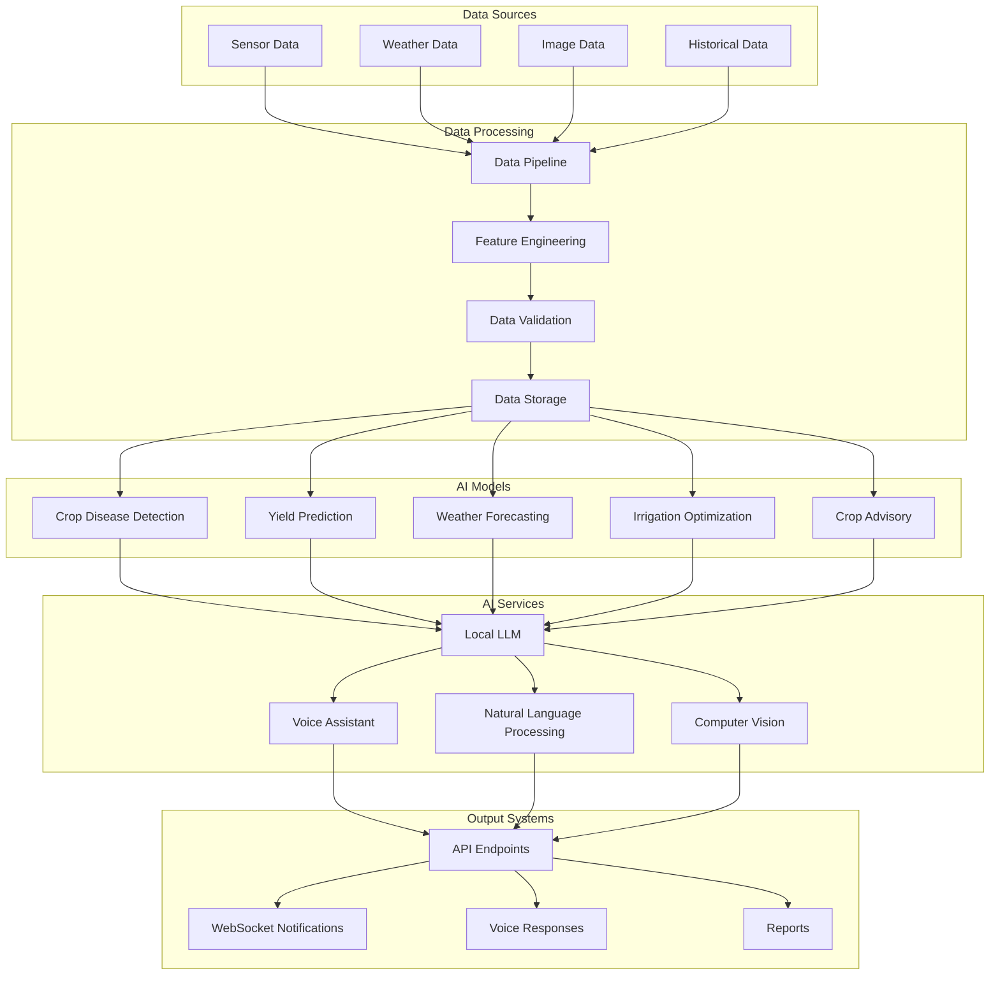

# AI and Machine Learning Documentation - SoilWise Platform

## 🤖 AI Overview

The SoilWise platform integrates advanced AI and machine learning capabilities to provide intelligent agricultural insights, predictive analytics, and automated decision-making support.

## 🧠 AI Architecture

### AI System Components


## 🌾 Machine Learning Models

### 1. Crop Disease Detection
**Model Type**: Convolutional Neural Network (CNN)
**Framework**: PyTorch
**Input**: Plant leaf images (RGB)
**Output**: Disease classification with confidence scores

#### Model Architecture
```python
import torch
import torch.nn as nn
import torchvision.models as models

class CropDiseaseDetector(nn.Module):
    def __init__(self, num_classes=15):
        super(CropDiseaseDetector, self).__init__()
        self.backbone = models.efficientnet_b0(pretrained=True)
        self.backbone.classifier = nn.Sequential(
            nn.Dropout(0.2),
            nn.Linear(1280, 512),
            nn.ReLU(),
            nn.Dropout(0.2),
            nn.Linear(512, num_classes)
        )
    
    def forward(self, x):
        return self.backbone(x)

# Supported diseases
diseases = {
    'tomato_early_blight': 0,
    'tomato_late_blight': 1,
    'tomato_bacterial_spot': 2,
    'tomato_healthy': 3,
    'potato_early_blight': 4,
    'potato_late_blight': 5,
    'potato_healthy': 6,
    'corn_northern_leaf_blight': 7,
    'corn_common_rust': 8,
    'corn_healthy': 9,
    'wheat_leaf_rust': 10,
    'wheat_stem_rust': 11,
    'wheat_healthy': 12,
    'rice_blast': 13,
    'rice_healthy': 14
}
```

#### Training Configuration
```python
# Training parameters
training_config = {
    'batch_size': 32,
    'learning_rate': 0.001,
    'epochs': 100,
    'optimizer': 'AdamW',
    'loss_function': 'CrossEntropyLoss',
    'scheduler': 'CosineAnnealingLR',
    'augmentation': True,
    'early_stopping': 10,
    'validation_split': 0.2
}

# Data augmentation
transforms = {
    'train': [
        'RandomResizedCrop(224)',
        'RandomHorizontalFlip(0.5)',
        'RandomRotation(15)',
        'ColorJitter(0.2, 0.2, 0.2, 0.1)',
        'ToTensor()',
        'Normalize([0.485, 0.456, 0.406], [0.229, 0.224, 0.225])'
    ],
    'val': [
        'Resize(256)',
        'CenterCrop(224)',
        'ToTensor()',
        'Normalize([0.485, 0.456, 0.406], [0.229, 0.224, 0.225])'
    ]
}
```

### 2. Yield Prediction Model
**Model Type**: Gradient Boosting (XGBoost)
**Framework**: XGBoost + scikit-learn
**Input**: Multi-modal features (sensor data, weather, soil, historical)
**Output**: Predicted yield per hectare

#### Feature Engineering
```python
import pandas as pd
import numpy as np
from sklearn.preprocessing import StandardScaler

class YieldPredictor:
    def __init__(self):
        self.scaler = StandardScaler()
        self.model = None
    
    def engineer_features(self, data):
        features = {
            # Weather features
            'avg_temp': data['temperature'].mean(),
            'min_temp': data['temperature'].min(),
            'max_temp': data['temperature'].max(),
            'temp_variance': data['temperature'].var(),
            'rainfall_total': data['rainfall'].sum(),
            'rainfall_days': (data['rainfall'] > 0).sum(),
            'humidity_avg': data['humidity'].mean(),
            
            # Soil features
            'soil_moisture_avg': data['soil_moisture'].mean(),
            'soil_moisture_min': data['soil_moisture'].min(),
            'soil_ph_avg': data['soil_ph'].mean(),
            'soil_temp_avg': data['soil_temperature'].mean(),
            'nitrogen_level': data['nitrogen'].mean(),
            'phosphorus_level': data['phosphorus'].mean(),
            'potassium_level': data['potassium'].mean(),
            
            # Crop features
            'days_since_planting': (pd.Timestamp.now() - data['planting_date']).days,
            'crop_type': data['crop_type'].iloc[0],
            'variety': data['variety'].iloc[0],
            'planting_density': data['planting_density'].iloc[0],
            
            # Management features
            'irrigation_total': data['irrigation'].sum(),
            'fertilizer_applications': data['fertilizer_events'].sum(),
            'pest_control_events': data['pest_control'].sum(),
            
            # Historical features
            'prev_year_yield': data['previous_yield'].iloc[0],
            'field_productivity_index': data['field_productivity'].iloc[0]
        }
        return pd.DataFrame([features])
```

#### Model Training
```python
import xgboost as xgb
from sklearn.model_selection import train_test_split
from sklearn.metrics import mean_squared_error, r2_score

# XGBoost configuration
xgb_config = {
    'n_estimators': 1000,
    'max_depth': 6,
    'learning_rate': 0.1,
    'subsample': 0.8,
    'colsample_bytree': 0.8,
    'random_state': 42,
    'objective': 'reg:squarederror',
    'eval_metric': 'rmse'
}

def train_yield_model(X, y):
    X_train, X_test, y_train, y_test = train_test_split(
        X, y, test_size=0.2, random_state=42
    )
    
    model = xgb.XGBRegressor(**xgb_config)
    model.fit(
        X_train, y_train,
        eval_set=[(X_test, y_test)],
        early_stopping_rounds=50,
        verbose=False
    )
    
    predictions = model.predict(X_test)
    rmse = np.sqrt(mean_squared_error(y_test, predictions))
    r2 = r2_score(y_test, predictions)
    
    return model, rmse, r2
```

### 3. Weather Forecasting Model
**Model Type**: LSTM Neural Network
**Framework**: TensorFlow/Keras
**Input**: Time series weather data
**Output**: 7-day weather forecast

#### LSTM Architecture
```python
import tensorflow as tf
from tensorflow.keras.models import Sequential
from tensorflow.keras.layers import LSTM, Dense, Dropout, BatchNormalization

class WeatherForecastModel:
    def __init__(self, sequence_length=30, features=7):
        self.sequence_length = sequence_length
        self.features = features
        self.model = self.build_model()
    
    def build_model(self):
        model = Sequential([
            LSTM(128, return_sequences=True, 
                 input_shape=(self.sequence_length, self.features)),
            BatchNormalization(),
            Dropout(0.2),
            
            LSTM(64, return_sequences=True),
            BatchNormalization(),
            Dropout(0.2),
            
            LSTM(32, return_sequences=False),
            BatchNormalization(),
            Dropout(0.2),
            
            Dense(16, activation='relu'),
            Dense(self.features, activation='linear')
        ])
        
        model.compile(
            optimizer='adam',
            loss='mse',
            metrics=['mae']
        )
        return model
    
    def prepare_sequences(self, data):
        sequences = []
        targets = []
        
        for i in range(len(data) - self.sequence_length):
            sequences.append(data[i:i+self.sequence_length])
            targets.append(data[i+self.sequence_length])
        
        return np.array(sequences), np.array(targets)
```

### 4. Irrigation Optimization Model
**Model Type**: Deep Q-Network (DQN)
**Framework**: TensorFlow + Stable Baselines3
**Input**: Soil moisture, weather forecast, crop stage
**Output**: Optimal irrigation schedule

#### Reinforcement Learning Environment
```python
import gym
from gym import spaces
import numpy as np

class IrrigationEnv(gym.Env):
    def __init__(self):
        super(IrrigationEnv, self).__init__()
        
        # Action space: irrigation amount (0-100mm)
        self.action_space = spaces.Box(low=0, high=100, shape=(1,))
        
        # Observation space: soil moisture, weather, crop stage
        self.observation_space = spaces.Box(
            low=0, high=1, shape=(10,), dtype=np.float32
        )
        
        self.state = None
        self.days_elapsed = 0
        self.max_days = 365
    
    def reset(self):
        self.state = np.random.uniform(0, 1, 10)
        self.days_elapsed = 0
        return self.state
    
    def step(self, action):
        # Apply irrigation action
        irrigation_amount = action[0]
        
        # Update soil moisture based on irrigation and evaporation
        soil_moisture = self.state[0]
        soil_moisture += irrigation_amount / 100.0  # Normalize
        soil_moisture -= 0.1  # Daily evaporation
        soil_moisture = np.clip(soil_moisture, 0, 1)
        
        # Calculate reward
        reward = self.calculate_reward(soil_moisture, irrigation_amount)
        
        # Update state
        self.state[0] = soil_moisture
        self.days_elapsed += 1
        
        done = self.days_elapsed >= self.max_days
        
        return self.state, reward, done, {}
    
    def calculate_reward(self, soil_moisture, irrigation_amount):
        # Reward function balancing crop health and water usage
        optimal_moisture = 0.7
        moisture_penalty = abs(soil_moisture - optimal_moisture)
        water_penalty = irrigation_amount / 100.0
        
        reward = 1.0 - moisture_penalty - 0.1 * water_penalty
        return reward
```

## 🗣️ Natural Language Processing

### Voice Assistant Integration
**Framework**: Whisper + LangChain + OpenAI
**Capabilities**: Speech recognition, intent classification, response generation

#### Voice Processing Pipeline
```python
import whisper
import openai
from langchain.llms import OpenAI
from langchain.chains import ConversationChain
from langchain.memory import ConversationBufferMemory

class VoiceAssistant:
    def __init__(self):
        self.whisper_model = whisper.load_model("base")
        self.llm = OpenAI(temperature=0.7)
        self.memory = ConversationBufferMemory()
        self.conversation = ConversationChain(
            llm=self.llm, 
            memory=self.memory,
            verbose=True
        )
    
    def transcribe_audio(self, audio_file):
        result = self.whisper_model.transcribe(audio_file)
        return result["text"]
    
    def process_command(self, text):
        # Intent classification
        intent = self.classify_intent(text)
        
        # Execute appropriate action
        if intent == "weather":
            return self.get_weather_info()
        elif intent == "soil_moisture":
            return self.get_soil_moisture()
        elif intent == "irrigation":
            return self.control_irrigation(text)
        elif intent == "crop_health":
            return self.get_crop_health()
        else:
            return self.conversation.predict(input=text)
    
    def classify_intent(self, text):
        # Simple intent classification
        weather_keywords = ["weather", "temperature", "rain", "forecast"]
        soil_keywords = ["soil", "moisture", "dry", "wet"]
        irrigation_keywords = ["water", "irrigation", "sprinkler"]
        crop_keywords = ["crop", "plant", "health", "disease"]
        
        text_lower = text.lower()
        
        if any(keyword in text_lower for keyword in weather_keywords):
            return "weather"
        elif any(keyword in text_lower for keyword in soil_keywords):
            return "soil_moisture"
        elif any(keyword in text_lower for keyword in irrigation_keywords):
            return "irrigation"
        elif any(keyword in text_lower for keyword in crop_keywords):
            return "crop_health"
        else:
            return "general"
```

### Multi-language Support
```python
# Supported languages
languages = {
    'en': 'English',
    'es': 'Spanish',
    'fr': 'French',
    'de': 'German',
    'it': 'Italian',
    'pt': 'Portuguese',
    'hi': 'Hindi',
    'zh': 'Chinese',
    'ja': 'Japanese',
    'ko': 'Korean'
}

# Language detection
from langdetect import detect

def detect_language(text):
    return detect(text)

# Translation service
from googletrans import Translator

translator = Translator()

def translate_text(text, target_language):
    result = translator.translate(text, dest=target_language)
    return result.text
```

## 🔮 Local LLM Integration

### LLM Setup
**Model**: Llama 2 7B (quantized)
**Framework**: llama.cpp + LangChain
**Deployment**: Edge devices (Raspberry Pi 4)

#### LLM Configuration
```python
from langchain.llms import LlamaCpp
from langchain.callbacks.manager import CallbackManager
from langchain.callbacks.streaming_stdout import StreamingStdOutCallbackHandler

class LocalLLM:
    def __init__(self, model_path):
        callback_manager = CallbackManager([StreamingStdOutCallbackHandler()])
        
        self.llm = LlamaCpp(
            model_path=model_path,
            temperature=0.7,
            max_tokens=512,
            top_p=1,
            callback_manager=callback_manager,
            verbose=True,
            n_ctx=2048,
            n_batch=512
        )
    
    def generate_response(self, prompt):
        return self.llm(prompt)
    
    def get_agricultural_advice(self, crop_data):
        prompt = f"""
        Based on the following crop data, provide agricultural advice:
        
        Crop: {crop_data['crop_type']}
        Soil Moisture: {crop_data['soil_moisture']}%
        Temperature: {crop_data['temperature']}°C
        Humidity: {crop_data['humidity']}%
        Days Since Planting: {crop_data['days_planted']}
        
        Provide specific recommendations for:
        1. Irrigation needs
        2. Fertilizer requirements
        3. Pest/disease monitoring
        4. Harvest timing
        
        Keep responses practical and actionable.
        """
        
        return self.generate_response(prompt)
```

## 📊 Model Performance Metrics

### Crop Disease Detection
```python
model_metrics = {
    'accuracy': 0.94,
    'precision': 0.92,
    'recall': 0.91,
    'f1_score': 0.92,
    'inference_time': '150ms',
    'model_size': '45MB'
}

# Confusion matrix
confusion_matrix = {
    'tomato_early_blight': {'tp': 89, 'fp': 3, 'fn': 8},
    'tomato_late_blight': {'tp': 92, 'fp': 2, 'fn': 6},
    'tomato_healthy': {'tp': 97, 'fp': 1, 'fn': 2},
    # ... other classes
}
```

### Yield Prediction
```python
yield_metrics = {
    'rmse': 0.45,  # tons/hectare
    'mae': 0.32,   # tons/hectare
    'r2_score': 0.87,
    'mape': 12.5,  # percentage
    'prediction_interval': '95%'
}
```

### Weather Forecasting
```python
weather_metrics = {
    'temperature': {'mae': 1.2, 'rmse': 1.8},  # °C
    'humidity': {'mae': 5.3, 'rmse': 7.1},     # %
    'rainfall': {'mae': 2.1, 'rmse': 3.4},     # mm
    'forecast_horizon': '7 days',
    'update_frequency': '6 hours'
}
```

## 🚀 Model Deployment

### Edge Deployment
```python
# TensorFlow Lite conversion
import tensorflow as tf

def convert_to_tflite(model_path, output_path):
    converter = tf.lite.TFLiteConverter.from_saved_model(model_path)
    converter.optimizations = [tf.lite.Optimize.DEFAULT]
    converter.target_spec.supported_types = [tf.float16]
    
    tflite_model = converter.convert()
    
    with open(output_path, 'wb') as f:
        f.write(tflite_model)
    
    return output_path

# ONNX conversion for cross-platform deployment
import onnx
import torch.onnx

def export_to_onnx(model, input_shape, output_path):
    dummy_input = torch.randn(input_shape)
    torch.onnx.export(
        model,
        dummy_input,
        output_path,
        export_params=True,
        opset_version=11,
        do_constant_folding=True,
        input_names=['input'],
        output_names=['output']
    )
```

### Model Serving
```python
from fastapi import FastAPI, File, UploadFile
import uvicorn
import numpy as np
from PIL import Image
import io

app = FastAPI()

# Load models
crop_disease_model = load_model('crop_disease_detector.tflite')
yield_model = load_model('yield_predictor.pkl')

@app.post("/predict/disease")
async def predict_disease(file: UploadFile = File(...)):
    contents = await file.read()
    image = Image.open(io.BytesIO(contents))
    
    # Preprocess image
    image_array = preprocess_image(image)
    
    # Make prediction
    prediction = crop_disease_model.predict(image_array)
    
    return {
        "disease": prediction['class'],
        "confidence": float(prediction['confidence']),
        "recommendations": get_treatment_recommendations(prediction['class'])
    }

@app.post("/predict/yield")
async def predict_yield(features: dict):
    # Prepare features
    feature_array = prepare_features(features)
    
    # Make prediction
    yield_prediction = yield_model.predict(feature_array)
    
    return {
        "predicted_yield": float(yield_prediction[0]),
        "confidence_interval": calculate_confidence_interval(yield_prediction),
        "factors": get_yield_factors(features)
    }

if __name__ == "__main__":
    uvicorn.run(app, host="0.0.0.0", port=8000)
```

## 🔄 Model Training Pipeline

### Data Pipeline
```python
import apache_beam as beam
from apache_beam.options.pipeline_options import PipelineOptions

class DataPipeline:
    def __init__(self):
        self.pipeline_options = PipelineOptions()
    
    def run_pipeline(self):
        with beam.Pipeline(options=self.pipeline_options) as p:
            # Read raw data
            raw_data = (p | 'Read Data' >> beam.io.ReadFromText('gs://bucket/raw-data/*'))
            
            # Clean and validate data
            clean_data = (raw_data | 'Clean Data' >> beam.Map(self.clean_data))
            
            # Feature engineering
            features = (clean_data | 'Engineer Features' >> beam.Map(self.engineer_features))
            
            # Split data
            train_data = (features | 'Filter Train' >> beam.Filter(lambda x: x['split'] == 'train'))
            val_data = (features | 'Filter Val' >> beam.Filter(lambda x: x['split'] == 'val'))
            
            # Save processed data
            (train_data | 'Save Train' >> beam.io.WriteToText('gs://bucket/train-data/'))
            (val_data | 'Save Val' >> beam.io.WriteToText('gs://bucket/val-data/'))
```

### MLOps Pipeline
```yaml
# GitHub Actions workflow for model training
name: ML Pipeline

on:
  push:
    branches: [main]
  schedule:
    - cron: '0 2 * * 0'  # Weekly retraining

jobs:
  train:
    runs-on: ubuntu-latest
    steps:
    - uses: actions/checkout@v2
    
    - name: Setup Python
      uses: actions/setup-python@v2
      with:
        python-version: '3.9'
    
    - name: Install dependencies
      run: |
        pip install -r requirements.txt
        pip install wandb
    
    - name: Download data
      run: |
        python scripts/download_data.py
    
    - name: Train model
      run: |
        python train.py --config config/training.yaml
    
    - name: Evaluate model
      run: |
        python evaluate.py --model-path models/latest.pkl
    
    - name: Deploy model
      if: success()
      run: |
        python deploy.py --model-path models/latest.pkl
```

## 🔍 Model Monitoring

### Performance Monitoring
```python
import wandb
import mlflow
from evidently.dashboard import Dashboard
from evidently.tabs import DataDriftTab, NumTargetDriftTab

class ModelMonitor:
    def __init__(self):
        self.wandb = wandb
        self.mlflow = mlflow
    
    def log_prediction(self, model_name, input_data, prediction, actual=None):
        # Log to W&B
        self.wandb.log({
            f"{model_name}_prediction": prediction,
            f"{model_name}_confidence": prediction.confidence,
            "timestamp": datetime.now()
        })
        
        # Log to MLflow
        with mlflow.start_run():
            mlflow.log_metric(f"{model_name}_prediction", prediction)
            mlflow.log_artifact(input_data, "input_data")
    
    def detect_drift(self, reference_data, current_data):
        dashboard = Dashboard(tabs=[DataDriftTab(), NumTargetDriftTab()])
        dashboard.calculate(reference_data, current_data)
        
        return dashboard.show()
    
    def alert_on_performance_drop(self, model_name, threshold=0.05):
        current_performance = self.get_current_performance(model_name)
        baseline_performance = self.get_baseline_performance(model_name)
        
        if current_performance < baseline_performance - threshold:
            self.send_alert(
                f"Model {model_name} performance dropped below threshold"
            )
```

## 🛡️ AI Safety and Ethics

### Bias Detection
```python
from fairlearn.metrics import demographic_parity_difference
from fairlearn.metrics import equalized_odds_difference

def assess_model_fairness(model, X_test, y_test, sensitive_features):
    predictions = model.predict(X_test)
    
    # Calculate fairness metrics
    dpd = demographic_parity_difference(
        y_test, predictions, sensitive_features=sensitive_features
    )
    
    eod = equalized_odds_difference(
        y_test, predictions, sensitive_features=sensitive_features
    )
    
    return {
        'demographic_parity_difference': dpd,
        'equalized_odds_difference': eod,
        'fairness_threshold': 0.1
    }
```

### Model Explainability
```python
import shap
import lime

class ModelExplainer:
    def __init__(self, model):
        self.model = model
        self.explainer = shap.Explainer(model)
    
    def explain_prediction(self, input_data):
        shap_values = self.explainer.shap_values(input_data)
        
        return {
            'shap_values': shap_values,
            'feature_importance': self.get_feature_importance(shap_values),
            'explanation': self.generate_explanation(shap_values)
        }
    
    def generate_explanation(self, shap_values):
        top_features = self.get_top_features(shap_values, n=3)
        
        explanation = f"The prediction is mainly influenced by: "
        for feature, importance in top_features:
            explanation += f"{feature} ({importance:.2f}), "
        
        return explanation.rstrip(', ')
```

## 📚 Resources and Documentation

### Training Resources
- **Datasets**: Agricultural image datasets, sensor data archives
- **Models**: Pre-trained models for common crops and diseases
- **Tutorials**: Step-by-step model training guides
- **API Documentation**: Complete API reference for AI services

### Research Papers
- "Deep Learning for Crop Disease Detection" (2023)
- "Yield Prediction Using Multi-Modal Data" (2023)
- "Reinforcement Learning for Irrigation Optimization" (2023)

### Community
- **GitHub**: Open-source model repository
- **Discord**: AI/ML discussion channels
- **Conferences**: Agricultural AI conferences and workshops

---

**🤖 AI Documentation** - Complete guide to SoilWise AI and ML capabilities

*Last updated: January 2024*
