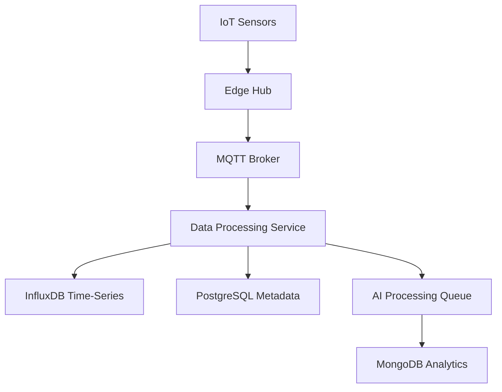

# Database Documentation - SoilWise Platform

## 📊 Database Architecture Overview

The SoilWise platform uses a multi-database architecture designed for agricultural data management, real-time processing, and scalability.

## 🗄️ Database Stack

### Primary Databases
- **PostgreSQL**: Main transactional database
- **InfluxDB**: Time-series data for sensor readings
- **Redis**: Caching and session management
- **MongoDB**: Document storage for AI models and analytics

### Edge Databases
- **SQLite**: Local storage on Raspberry Pi edge devices
- **LevelDB**: Fast key-value storage for IoT data buffering

## 🏗️ Database Schema

### Core Tables (PostgreSQL)

#### Users and Authentication
```sql
-- users table
CREATE TABLE users (
    id UUID PRIMARY KEY DEFAULT gen_random_uuid(),
    email VARCHAR(255) UNIQUE NOT NULL,
    password_hash VARCHAR(255) NOT NULL,
    role VARCHAR(50) DEFAULT 'farmer',
    created_at TIMESTAMP DEFAULT CURRENT_TIMESTAMP,
    updated_at TIMESTAMP DEFAULT CURRENT_TIMESTAMP
);

-- user_profiles table
CREATE TABLE user_profiles (
    id UUID PRIMARY KEY DEFAULT gen_random_uuid(),
    user_id UUID REFERENCES users(id) ON DELETE CASCADE,
    first_name VARCHAR(100),
    last_name VARCHAR(100),
    phone VARCHAR(20),
    language VARCHAR(10) DEFAULT 'en',
    timezone VARCHAR(50) DEFAULT 'UTC',
    created_at TIMESTAMP DEFAULT CURRENT_TIMESTAMP
);
```

#### Farm Management
```sql
-- farms table
CREATE TABLE farms (
    id UUID PRIMARY KEY DEFAULT gen_random_uuid(),
    owner_id UUID REFERENCES users(id) ON DELETE CASCADE,
    name VARCHAR(255) NOT NULL,
    location GEOGRAPHY(POINT, 4326),
    area_hectares DECIMAL(10, 2),
    soil_type VARCHAR(100),
    climate_zone VARCHAR(100),
    created_at TIMESTAMP DEFAULT CURRENT_TIMESTAMP
);

-- farm_fields table
CREATE TABLE farm_fields (
    id UUID PRIMARY KEY DEFAULT gen_random_uuid(),
    farm_id UUID REFERENCES farms(id) ON DELETE CASCADE,
    name VARCHAR(255) NOT NULL,
    crop_type VARCHAR(100),
    planting_date DATE,
    harvest_date DATE,
    area_hectares DECIMAL(8, 2),
    soil_ph DECIMAL(3, 1),
    boundary GEOGRAPHY(POLYGON, 4326),
    created_at TIMESTAMP DEFAULT CURRENT_TIMESTAMP
);
```

#### IoT Devices and Sensors
```sql
-- devices table
CREATE TABLE devices (
    id UUID PRIMARY KEY DEFAULT gen_random_uuid(),
    farm_id UUID REFERENCES farms(id) ON DELETE CASCADE,
    device_type VARCHAR(50) NOT NULL,
    device_id VARCHAR(100) UNIQUE NOT NULL,
    name VARCHAR(255),
    location GEOGRAPHY(POINT, 4326),
    battery_level INTEGER,
    signal_strength INTEGER,
    firmware_version VARCHAR(50),
    is_active BOOLEAN DEFAULT true,
    last_seen TIMESTAMP,
    created_at TIMESTAMP DEFAULT CURRENT_TIMESTAMP
);

-- sensor_types table
CREATE TABLE sensor_types (
    id UUID PRIMARY KEY DEFAULT gen_random_uuid(),
    type_name VARCHAR(100) NOT NULL,
    measurement_unit VARCHAR(20),
    min_value DECIMAL(10, 2),
    max_value DECIMAL(10, 2),
    description TEXT
);

-- device_sensors table
CREATE TABLE device_sensors (
    id UUID PRIMARY KEY DEFAULT gen_random_uuid(),
    device_id UUID REFERENCES devices(id) ON DELETE CASCADE,
    sensor_type_id UUID REFERENCES sensor_types(id),
    calibration_offset DECIMAL(10, 4) DEFAULT 0,
    is_enabled BOOLEAN DEFAULT true
);
```

### Time-Series Data (InfluxDB)

#### Sensor Readings
```sql
-- Measurement: sensor_data
-- Tags: device_id, sensor_type, farm_id, field_id
-- Fields: value, battery_level, signal_strength
-- Time: timestamp

-- Example query
SELECT mean("value") as avg_value 
FROM "sensor_data" 
WHERE "sensor_type" = 'soil_moisture' 
AND "farm_id" = 'farm_123' 
AND time >= now() - 24h 
GROUP BY time(1h)
```

#### Weather Data
```sql
-- Measurement: weather_data
-- Tags: location, source
-- Fields: temperature, humidity, pressure, wind_speed, rainfall
-- Time: timestamp

-- Measurement: weather_forecast
-- Tags: location, source, forecast_hour
-- Fields: temperature, humidity, precipitation_prob
-- Time: timestamp
```

### Document Storage (MongoDB)

#### AI Models and Analytics
```javascript
// ai_models collection
{
  "_id": ObjectId("..."),
  "model_name": "crop_disease_detector",
  "version": "1.2.0",
  "model_type": "classification",
  "crop_types": ["tomato", "potato", "corn"],
  "accuracy": 0.94,
  "training_data": {
    "samples": 10000,
    "last_trained": "2024-01-15T10:00:00Z"
  },
  "model_file": "s3://models/crop_disease_v1.2.0.pkl",
  "created_at": "2024-01-15T10:00:00Z"
}

// analytics_reports collection
{
  "_id": ObjectId("..."),
  "farm_id": "farm_123",
  "report_type": "yield_prediction",
  "period": {
    "start": "2024-01-01",
    "end": "2024-01-31"
  },
  "data": {
    "predicted_yield": 4.5,
    "confidence": 0.87,
    "factors": ["weather", "soil_moisture", "fertilizer"]
  },
  "generated_at": "2024-02-01T08:00:00Z"
}
```

## 🔄 Data Flow Architecture

### Data Ingestion Pipeline


### Real-time Processing
1. **Sensor Data**: IoT → Edge Hub → MQTT → InfluxDB
2. **Metadata**: Device info → PostgreSQL
3. **Analytics**: Processed data → MongoDB
4. **Alerts**: Threshold violations → Notification Service

## 🔧 Database Configuration

### PostgreSQL Configuration
```sql
-- Performance optimizations
shared_buffers = 256MB
effective_cache_size = 1GB
maintenance_work_mem = 64MB
checkpoint_completion_target = 0.9
wal_buffers = 16MB
default_statistics_target = 100
```

### InfluxDB Configuration
```toml
[data]
  cache-max-memory-size = "1g"
  cache-snapshot-memory-size = "25m"
  cache-snapshot-write-cold-duration = "10m"

[coordinator]
  write-timeout = "10s"
  max-concurrent-queries = 0
  query-timeout = "0s"
```

## 🔍 Indexing Strategy

### PostgreSQL Indexes
```sql
-- Performance indexes
CREATE INDEX idx_farms_owner_id ON farms(owner_id);
CREATE INDEX idx_devices_farm_id ON devices(farm_id);
CREATE INDEX idx_sensor_data_device_time ON sensor_readings(device_id, recorded_at);
CREATE INDEX idx_users_email ON users(email);

-- Geospatial indexes
CREATE INDEX idx_farms_location ON farms USING GIST(location);
CREATE INDEX idx_devices_location ON devices USING GIST(location);
```

### InfluxDB Indexes
```sql
-- Tag indexes (automatic)
-- device_id, sensor_type, farm_id are automatically indexed as tags

-- Time-based retention policies
CREATE RETENTION POLICY "one_week" ON "sensor_data" DURATION 7d REPLICATION 1;
CREATE RETENTION POLICY "one_month" ON "sensor_data" DURATION 30d REPLICATION 1;
CREATE RETENTION POLICY "one_year" ON "sensor_data" DURATION 365d REPLICATION 1;
```

## 🗂️ Data Partitioning

### Time-based Partitioning
```sql
-- PostgreSQL partitioning for sensor readings
CREATE TABLE sensor_readings (
    id UUID DEFAULT gen_random_uuid(),
    device_id UUID NOT NULL,
    sensor_type VARCHAR(50) NOT NULL,
    value DECIMAL(10, 4) NOT NULL,
    recorded_at TIMESTAMP NOT NULL
) PARTITION BY RANGE (recorded_at);

-- Monthly partitions
CREATE TABLE sensor_readings_2024_01 PARTITION OF sensor_readings
FOR VALUES FROM ('2024-01-01') TO ('2024-02-01');
```

### Sharding Strategy
- **Horizontal**: By farm_id for multi-tenant isolation
- **Vertical**: Separate read/write replicas
- **Geographic**: Regional data centers for global deployment

## 🔒 Security and Access Control

### Row-Level Security
```sql
-- Enable RLS on farms table
ALTER TABLE farms ENABLE ROW LEVEL SECURITY;

-- Policy for users to see only their farms
CREATE POLICY user_farms_policy ON farms
    FOR ALL TO authenticated_user
    USING (owner_id = current_user_id());
```

### Database Users and Roles
```sql
-- Application roles
CREATE ROLE app_read;
CREATE ROLE app_write;
CREATE ROLE app_admin;

-- Grant permissions
GRANT SELECT ON ALL TABLES IN SCHEMA public TO app_read;
GRANT INSERT, UPDATE, DELETE ON ALL TABLES IN SCHEMA public TO app_write;
GRANT ALL PRIVILEGES ON ALL TABLES IN SCHEMA public TO app_admin;
```

## 🚀 Performance Optimization

### Query Optimization
```sql
-- Example optimized query for dashboard
WITH farm_summary AS (
    SELECT 
        f.id,
        f.name,
        COUNT(d.id) as device_count,
        AVG(sr.value) as avg_soil_moisture
    FROM farms f
    LEFT JOIN devices d ON f.id = d.farm_id
    LEFT JOIN sensor_readings sr ON d.id = sr.device_id
    WHERE sr.recorded_at >= NOW() - INTERVAL '24 hours'
    AND sr.sensor_type = 'soil_moisture'
    GROUP BY f.id, f.name
)
SELECT * FROM farm_summary
ORDER BY avg_soil_moisture DESC;
```

### Connection Pooling
```javascript
// Node.js connection pool configuration
const pool = new Pool({
  host: process.env.DB_HOST,
  port: process.env.DB_PORT,
  database: process.env.DB_NAME,
  user: process.env.DB_USER,
  password: process.env.DB_PASSWORD,
  max: 20, // Maximum pool size
  idleTimeoutMillis: 30000,
  connectionTimeoutMillis: 2000,
});
```

## 📊 Monitoring and Maintenance

### Database Monitoring
```sql
-- Check database performance
SELECT 
    schemaname,
    tablename,
    n_tup_ins,
    n_tup_upd,
    n_tup_del,
    n_live_tup,
    n_dead_tup
FROM pg_stat_user_tables
ORDER BY n_live_tup DESC;

-- Check index usage
SELECT 
    tablename,
    indexname,
    idx_tup_read,
    idx_tup_fetch
FROM pg_stat_user_indexes
ORDER BY idx_tup_read DESC;
```

### Backup Strategy
```bash
# PostgreSQL backup
pg_dump -h localhost -U postgres soilwise > backup_$(date +%Y%m%d).sql

# InfluxDB backup
influxd backup -portable /path/to/backup

# MongoDB backup
mongodump --db soilwise --out /path/to/backup
```

## 🔄 Migration and Versioning

### Database Migrations
```javascript
// Example migration using Knex.js
exports.up = function(knex) {
  return knex.schema.createTable('irrigation_schedules', function(table) {
    table.uuid('id').primary().defaultTo(knex.raw('gen_random_uuid()'));
    table.uuid('field_id').references('id').inTable('farm_fields');
    table.timestamp('scheduled_time').notNullable();
    table.integer('duration_minutes').notNullable();
    table.decimal('water_amount_liters', 10, 2);
    table.string('status', 20).defaultTo('pending');
    table.timestamps(true, true);
  });
};

exports.down = function(knex) {
  return knex.schema.dropTableIfExists('irrigation_schedules');
};
```

### Version Control
- **Schema Versions**: Track with migrations table
- **Data Versions**: Use timestamps and version columns
- **Rollback Strategy**: Maintain migration rollback scripts

## 📈 Scaling Strategies

### Horizontal Scaling
- **Read Replicas**: For read-heavy workloads
- **Sharding**: Geographic or tenant-based
- **Microservices**: Database per service pattern

### Vertical Scaling
- **Resource Optimization**: CPU, memory, storage
- **Query Optimization**: Index tuning, query rewriting
- **Connection Pooling**: Efficient connection management

## 🛠️ Development Tools

### Database Management
- **pgAdmin**: PostgreSQL administration
- **InfluxDB UI**: Time-series data visualization
- **MongoDB Compass**: Document database management
- **Redis CLI**: Cache management

### Development Scripts
```bash
# Setup development database
npm run db:setup

# Run migrations
npm run db:migrate

# Seed test data
npm run db:seed

# Reset database
npm run db:reset
```

## 🔍 Troubleshooting

### Common Issues
1. **Connection Timeouts**: Check connection pool settings
2. **Slow Queries**: Analyze with EXPLAIN ANALYZE
3. **Storage Issues**: Monitor disk space and cleanup
4. **Replication Lag**: Check replica health

### Debug Queries
```sql
-- Check active connections
SELECT * FROM pg_stat_activity WHERE state = 'active';

-- Check table sizes
SELECT 
    schemaname,
    tablename,
    pg_size_pretty(pg_total_relation_size(tablename::regclass)) as size
FROM pg_tables
WHERE schemaname = 'public'
ORDER BY pg_total_relation_size(tablename::regclass) DESC;
```

## 📚 Additional Resources

### Documentation
- [PostgreSQL Documentation](https://www.postgresql.org/docs/)
- [InfluxDB Documentation](https://docs.influxdata.com/)
- [MongoDB Documentation](https://docs.mongodb.com/)
- [Redis Documentation](https://redis.io/documentation)

### Best Practices
- Follow ACID principles for transactional data
- Use appropriate data types for optimization
- Implement proper indexing strategies
- Monitor performance regularly
- Plan for data growth and scaling

---

**🗄️ Database Documentation** - Complete guide to SoilWise data architecture

*Last updated: January 2024*
