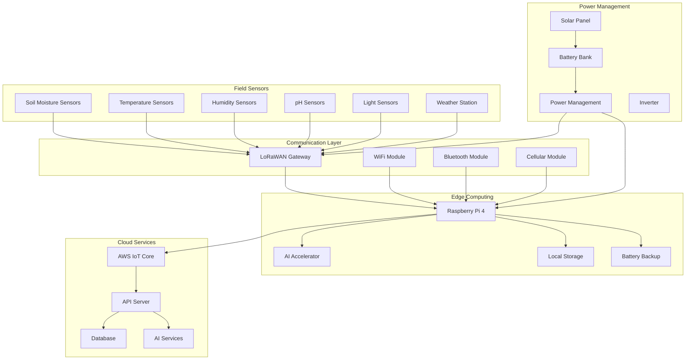

# Hardware Documentation - SoilWise Platform

## 🔌 Hardware Overview

The SoilWise platform integrates various IoT sensors, edge computing devices, and communication systems to provide comprehensive agricultural monitoring and automation.

## 📊 Hardware Architecture

### System Components


## 🌾 Field Sensors

### Soil Moisture Sensors
**Model**: Capacitive Soil Moisture Sensor v2.0
**Specifications**:
- Measurement Range: 0-100% RH
- Accuracy: ±2% RH
- Resolution: 0.1% RH
- Operating Temperature: -40°C to +85°C
- Power Consumption: 5mA active, 50µA sleep
- Communication: Analog/I2C

**Installation**:
```bash
# Sensor placement depth recommendations
Shallow: 10-15cm  # Root zone monitoring
Medium:  30-45cm  # Subsoil moisture
Deep:    60-90cm  # Deep water table
```

**Calibration**:
```javascript
// Soil moisture calibration values
const calibration = {
  air_value: 520,      // Sensor in air
  water_value: 260,    // Sensor in water
  wet_soil: 300,       // Wet soil threshold
  dry_soil: 480        // Dry soil threshold
};
```

### Temperature Sensors
**Model**: DS18B20 Waterproof Temperature Sensor
**Specifications**:
- Measurement Range: -55°C to +125°C
- Accuracy: ±0.5°C (-10°C to +85°C)
- Resolution: 9 to 12 bits (configurable)
- Communication: 1-Wire protocol
- Power Supply: 3.0V to 5.5V

**Wiring**:
```
DS18B20 Connections:
Red Wire    -> 3.3V/5V
Black Wire  -> GND
Yellow Wire -> GPIO4 (with 4.7kΩ pullup resistor)
```

### pH Sensors
**Model**: Gravity Analog pH Sensor
**Specifications**:
- Measurement Range: 0-14 pH
- Accuracy: ±0.1 pH
- Response Time: <1 minute
- Operating Temperature: 0-60°C
- Power Supply: 3.3V/5V

**Calibration Procedure**:
```javascript
// pH sensor calibration
const phCalibration = {
  step1: {
    solution: 'pH 7.0 buffer',
    expected: 7.0,
    voltage: 2.5  // Measured voltage
  },
  step2: {
    solution: 'pH 4.0 buffer',
    expected: 4.0,
    voltage: 2.0  // Measured voltage
  },
  step3: {
    solution: 'pH 10.0 buffer',
    expected: 10.0,
    voltage: 3.0  // Measured voltage
  }
};
```

### Weather Station
**Model**: All-in-One Weather Sensor
**Measurements**:
- Temperature: -40°C to +60°C
- Humidity: 0-100% RH
- Barometric Pressure: 300-1100 hPa
- Wind Speed: 0-60 m/s
- Wind Direction: 0-360°
- Rainfall: 0-4mm/min

**Communication**: RS485 Modbus RTU
**Power**: 12V DC, 2W average

## 🔌 Communication Systems

### LoRaWAN Gateway
**Model**: RAK7258 WisGate Edge Lite
**Specifications**:
- Frequency: 868MHz (EU), 915MHz (US)
- Range: Up to 10km (line of sight)
- Channels: 8 half-duplex channels
- Power: 12V DC, 12W
- Connectivity: Ethernet, WiFi, Cellular

**Configuration**:
```json
{
  "gateway_id": "soilwise_gateway_001",
  "frequency_plan": "EU_863_870",
  "server": {
    "address": "eu1.cloud.thethings.network",
    "port": 1700
  },
  "antenna": {
    "gain": 3,
    "height": 10
  }
}
```

### Cellular Module
**Model**: SIM7600G-H 4G HAT
**Specifications**:
- Network: 4G/3G/2G
- Bands: B1/B3/B5/B7/B8/B20/B28A/B38/B40/B41
- GPS: Built-in GNSS
- Power: 5V, 2A peak
- Interface: USB/UART

**Setup**:
```bash
# Enable cellular module
sudo raspi-config
# Interface Options -> Serial -> No -> Yes

# Install dependencies
sudo apt-get install ppp wvdial

# Configure APN
sudo nano /etc/wvdial.conf
```

## 🖥️ Edge Computing Hardware

### Raspberry Pi 4 Edge Hub
**Model**: Raspberry Pi 4 Model B (4GB RAM)
**Specifications**:
- CPU: Quad-core ARM Cortex-A72 1.5GHz
- RAM: 4GB LPDDR4
- Storage: 64GB microSD + 1TB USB SSD
- GPIO: 40-pin header
- Network: Gigabit Ethernet, WiFi 802.11ac, Bluetooth 5.0

**Case and Cooling**:
```
Recommended Setup:
- Aluminum case with heatsink
- Active cooling fan (5V)
- Temperature monitoring
- Thermal throttling protection
```

### AI Accelerator
**Model**: Google Coral USB Accelerator
**Specifications**:
- Chip: Google Edge TPU
- Performance: 4 TOPS (int8)
- Interface: USB 3.0
- Power: 2W typical, 2.5W maximum
- Supported Frameworks: TensorFlow Lite

**Installation**:
```bash
# Install Edge TPU runtime
echo "deb https://packages.cloud.google.com/apt coral-edgetpu-stable main" | sudo tee /etc/apt/sources.list.d/coral-edgetpu.list
curl https://packages.cloud.google.com/apt/doc/apt-key.gpg | sudo apt-key add -
sudo apt-get update
sudo apt-get install libedgetpu1-std
sudo apt-get install python3-pycoral
```

## ⚡ Power Management

### Solar Power System
**Components**:
- Solar Panel: 100W monocrystalline
- Battery: 12V 100Ah LiFePO4
- Charge Controller: MPPT 30A
- Inverter: 300W pure sine wave
- Monitoring: Battery voltage/current sensor

**Sizing Calculation**:
```javascript
// Power consumption calculation
const powerConsumption = {
  raspberry_pi: 4,      // 4W average
  sensors: 2,           // 2W total
  lora_gateway: 8,      // 8W average
  cellular: 3,          // 3W average (standby)
  total: 17             // 17W total
};

// Daily energy requirement
const dailyEnergy = powerConsumption.total * 24; // 408Wh
const batteryCapacity = 12 * 100; // 1200Wh
const autonomyDays = batteryCapacity / dailyEnergy; // ~3 days
```

### Battery Management
**Model**: 12V 100Ah LiFePO4 Battery
**Specifications**:
- Capacity: 100Ah (1280Wh)
- Voltage: 12.8V nominal
- Cycles: 6000+ cycles at 80% DOD
- Temperature: -20°C to +60°C
- Built-in BMS (Battery Management System)

**Monitoring**:
```python
# Battery monitoring script
import board
import busio
import adafruit_ina260

i2c = busio.I2C(board.SCL, board.SDA)
ina260 = adafruit_ina260.INA260(i2c)

def get_battery_status():
    return {
        'voltage': ina260.voltage,
        'current': ina260.current,
        'power': ina260.power,
        'soc': calculate_soc(ina260.voltage)
    }
```

## 🛠️ Installation Guidelines

### Site Preparation
1. **Location Survey**:
   - GPS coordinates mapping
   - Soil type assessment
   - Sun exposure analysis
   - Drainage evaluation

2. **Infrastructure Setup**:
   - Sensor mounting posts
   - Cable routing and protection
   - Gateway installation height
   - Solar panel positioning

### Sensor Installation
```bash
# Soil sensor installation checklist
1. Dig holes at specified depths
2. Install sensors with proper orientation
3. Backfill with original soil
4. Mark sensor locations with flags
5. Record GPS coordinates
6. Test sensor readings
7. Waterproof all connections
```

### Cable Management
**Specifications**:
- Outdoor rated cables (UV resistant)
- Waterproof connectors (IP67)
- Cable burial depth: 30cm minimum
- Conduit protection in high-traffic areas
- Strain relief at all connections

## 🔧 Maintenance Procedures

### Regular Maintenance Schedule
| Component | Frequency | Tasks |
|-----------|-----------|-------|
| Sensors | Monthly | Clean, calibrate, check connections |
| Solar Panel | Monthly | Clean surface, check mounting |
| Battery | Monthly | Check voltage, terminals, BMS status |
| Gateway | Quarterly | Firmware update, antenna check |
| Raspberry Pi | Quarterly | Software update, storage check |

### Troubleshooting Guide
```bash
# Common hardware issues and solutions

# Sensor not responding
1. Check power supply voltage
2. Verify wiring connections
3. Test with multimeter
4. Replace if faulty

# Gateway connectivity issues
1. Check network configuration
2. Verify antenna connections
3. Check power supply
4. Review gateway logs

# Battery issues
1. Check charge controller operation
2. Verify battery voltage
3. Test load disconnect
4. Check BMS error codes
```

## 📊 Monitoring and Diagnostics

### Hardware Health Monitoring
```javascript
// Hardware monitoring metrics
const healthMetrics = {
  power: {
    battery_voltage: 12.8,
    solar_current: 5.2,
    load_current: 1.4,
    charge_state: 'bulk'
  },
  temperature: {
    cpu_temp: 45.2,
    ambient_temp: 22.1,
    battery_temp: 25.6
  },
  connectivity: {
    lora_rssi: -85,
    cellular_signal: 18,
    wifi_strength: -45
  },
  storage: {
    disk_usage: 65,
    memory_usage: 45,
    cpu_usage: 25
  }
};
```

### Alert Thresholds
```yaml
alerts:
  battery_low: 20%
  high_temperature: 70°C
  low_signal: -100dBm
  disk_full: 90%
  sensor_offline: 5min
```

## 🔒 Security Considerations

### Physical Security
- Tamper-proof enclosures
- Anti-theft mounting systems
- Location concealment
- Access control logging

### Network Security
- VPN connections for remote access
- Encrypted communication (TLS/SSL)
- Device authentication certificates
- Regular security updates

## 💰 Cost Analysis

### Hardware Costs (per installation)
| Component | Cost (USD) | Quantity | Total |
|-----------|------------|----------|-------|
| Raspberry Pi 4 | $75 | 1 | $75 |
| Sensors (soil, temp, pH) | $150 | 1 set | $150 |
| LoRaWAN Gateway | $200 | 1 | $200 |
| Solar System | $300 | 1 | $300 |
| Enclosures & Cables | $100 | 1 | $100 |
| **Total per site** | | | **$825** |

### Scalability Options
- **Basic Setup**: $500 (minimal sensors)
- **Standard Setup**: $825 (full monitoring)
- **Premium Setup**: $1200 (with AI accelerator)

## 📈 Performance Specifications

### Data Collection Performance
- **Sensor Reading Frequency**: 1 minute to 1 hour (configurable)
- **Data Transmission**: Every 5-15 minutes
- **Storage Capacity**: 30 days local storage
- **Processing Latency**: <1 second for local analysis

### Network Performance
- **LoRaWAN Range**: 2-10km depending on terrain
- **Cellular Backup**: 4G/3G fallback
- **WiFi Connectivity**: 802.11ac for setup/maintenance

## 🛡️ Reliability and Redundancy

### Fault Tolerance
- **Dual Communication**: LoRaWAN + Cellular backup
- **Local Storage**: 30-day data buffer
- **Watchdog Timer**: Automatic system recovery
- **Redundant Sensors**: Critical measurements duplicated

### Environmental Protection
- **IP Rating**: IP65 for outdoor equipment
- **Temperature Range**: -20°C to +70°C operation
- **Humidity**: 0-95% RH non-condensing
- **Vibration**: IEC 60068-2-6 compliant

## 📚 Technical Documentation

### Wiring Diagrams
```
GPIO Pin Assignments (Raspberry Pi):
GPIO 4  -> Temperature sensors (1-Wire)
GPIO 14 -> UART TX (Serial communication)
GPIO 15 -> UART RX (Serial communication)
GPIO 18 -> PWM (Fan control)
GPIO 23 -> Status LED
GPIO 24 -> Relay control
```

### Firmware Updates
```bash
# Update procedure
1. Download latest firmware
2. Verify checksum
3. Backup current configuration
4. Flash new firmware
5. Restore configuration
6. Test functionality
```

## 🔧 Development Kit

### Getting Started Kit Contents
- Raspberry Pi 4 (4GB) with case
- microSD card (64GB) with pre-installed OS
- Sensor starter pack (soil moisture, temperature, pH)
- LoRaWAN module and antenna
- Breadboard and jumper wires
- Power supply and battery pack
- Documentation and quick start guide

### Assembly Instructions
1. **Setup Raspberry Pi**:
   - Flash SD card with SoilWise OS image
   - Connect sensors to GPIO pins
   - Install in weatherproof case

2. **Configure Sensors**:
   - Run calibration scripts
   - Set measurement intervals
   - Test data collection

3. **Network Setup**:
   - Configure LoRaWAN credentials
   - Set up WiFi for initial setup
   - Test connectivity to cloud

## 📞 Support and Resources

### Technical Support
- **Hardware Issues**: hardware@soilwise.com
- **Installation Help**: install@soilwise.com
- **Firmware Updates**: firmware@soilwise.com

### Documentation
- [Quick Start Guide](quick-start.md)
- [Troubleshooting Guide](troubleshooting.md)
- [API Integration](../api/README.md)

### Community
- **Forum**: https://forum.soilwise.com
- **Discord**: https://discord.gg/soilwise
- **GitHub**: https://github.com/soilwise-ai

---

**🔌 Hardware Documentation** - Complete guide to SoilWise IoT hardware

*Last updated: January 2024*
