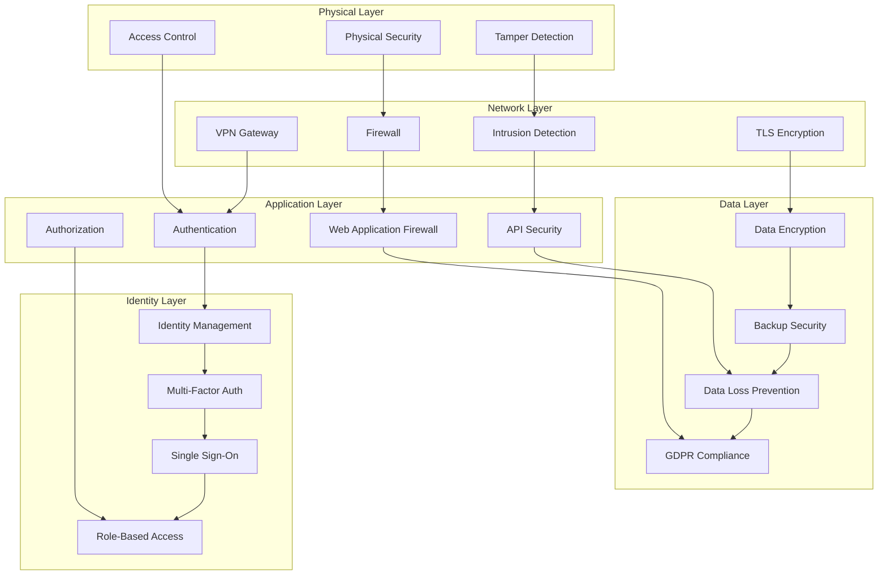

# Security Documentation - SoilWise Platform

## 🔒 Security Overview

The SoilWise platform implements comprehensive security measures to protect agricultural data, ensure device integrity, and maintain user privacy across all components of the system.

## 🛡️ Security Architecture

### Multi-Layer Security Model


## 🔐 Authentication and Authorization

### JWT Token Management
```typescript
interface JWTPayload {
  sub: string;           // User ID
  email: string;         // User email
  role: string;          // User role
  permissions: string[]; // Specific permissions
  farm_ids: string[];    // Accessible farms
  iat: number;           // Issued at
  exp: number;           // Expiration
  aud: string;           // Audience
  iss: string;           // Issuer
}

class TokenService {
  private readonly secret: string;
  private readonly algorithm = 'RS256';
  
  generateToken(payload: JWTPayload): string {
    return jwt.sign(payload, this.secret, {
      algorithm: this.algorithm,
      expiresIn: '24h',
      issuer: 'soilwise-platform',
      audience: 'soilwise-api'
    });
  }
  
  verifyToken(token: string): JWTPayload {
    try {
      return jwt.verify(token, this.secret, {
        algorithms: [this.algorithm],
        issuer: 'soilwise-platform',
        audience: 'soilwise-api'
      }) as JWTPayload;
    } catch (error) {
      throw new UnauthorizedError('Invalid token');
    }
  }
  
  refreshToken(refreshToken: string): string {
    const payload = this.verifyRefreshToken(refreshToken);
    return this.generateToken(payload);
  }
}
```

### Role-Based Access Control (RBAC)
```typescript
enum Role {
  ADMIN = 'admin',
  FARM_MANAGER = 'farm_manager',
  FARMER = 'farmer',
  VIEWER = 'viewer',
  TECHNICIAN = 'technician'
}

interface Permission {
  resource: string;
  action: string;
  conditions?: Record<string, any>;
}

const rolePermissions: Record<Role, Permission[]> = {
  [Role.ADMIN]: [
    { resource: '*', action: '*' }
  ],
  [Role.FARM_MANAGER]: [
    { resource: 'farms', action: 'read|write|delete', conditions: { owner: true } },
    { resource: 'users', action: 'read|invite', conditions: { farm_access: true } },
    { resource: 'devices', action: 'read|write|delete', conditions: { farm_access: true } },
    { resource: 'analytics', action: 'read', conditions: { farm_access: true } }
  ],
  [Role.FARMER]: [
    { resource: 'farms', action: 'read|write', conditions: { member: true } },
    { resource: 'devices', action: 'read|write', conditions: { farm_access: true } },
    { resource: 'analytics', action: 'read', conditions: { farm_access: true } }
  ],
  [Role.VIEWER]: [
    { resource: 'farms', action: 'read', conditions: { member: true } },
    { resource: 'devices', action: 'read', conditions: { farm_access: true } },
    { resource: 'analytics', action: 'read', conditions: { farm_access: true } }
  ],
  [Role.TECHNICIAN]: [
    { resource: 'devices', action: 'read|write|maintenance', conditions: { assigned: true } },
    { resource: 'diagnostics', action: 'read|write' }
  ]
};

class AuthorizationService {
  checkPermission(user: User, resource: string, action: string, context?: any): boolean {
    const permissions = rolePermissions[user.role];
    
    return permissions.some(permission => {
      const resourceMatch = permission.resource === '*' || permission.resource === resource;
      const actionMatch = permission.action === '*' || permission.action.includes(action);
      const conditionsMatch = this.evaluateConditions(permission.conditions, user, context);
      
      return resourceMatch && actionMatch && conditionsMatch;
    });
  }
  
  private evaluateConditions(conditions: any, user: User, context: any): boolean {
    if (!conditions) return true;
    
    // Evaluate dynamic conditions
    if (conditions.owner && context?.farm?.owner_id !== user.id) return false;
    if (conditions.member && !user.farm_ids.includes(context?.farm?.id)) return false;
    if (conditions.farm_access && !user.farm_ids.includes(context?.farm_id)) return false;
    
    return true;
  }
}
```

### Multi-Factor Authentication (MFA)
```typescript
import speakeasy from 'speakeasy';
import qrcode from 'qrcode';

class MFAService {
  generateTOTPSecret(userId: string): { secret: string; qrCode: string } {
    const secret = speakeasy.generateSecret({
      name: `SoilWise (${userId})`,
      issuer: 'SoilWise Platform',
      length: 32
    });
    
    const qrCode = qrcode.toDataURL(secret.otpauth_url);
    
    return {
      secret: secret.base32,
      qrCode
    };
  }
  
  verifyTOTP(token: string, secret: string): boolean {
    return speakeasy.totp.verify({
      secret,
      encoding: 'base32',
      token,
      window: 2
    });
  }
  
  generateBackupCodes(): string[] {
    const codes = [];
    for (let i = 0; i < 10; i++) {
      codes.push(crypto.randomBytes(4).toString('hex').toUpperCase());
    }
    return codes;
  }
}
```

## 🔄 Data Encryption

### Encryption at Rest
```typescript
import crypto from 'crypto';

class EncryptionService {
  private readonly algorithm = 'aes-256-gcm';
  private readonly keyDerivationRounds = 100000;
  
  encrypt(data: string, password: string): EncryptedData {
    const salt = crypto.randomBytes(16);
    const key = crypto.pbkdf2Sync(password, salt, this.keyDerivationRounds, 32, 'sha256');
    
    const cipher = crypto.createCipher(this.algorithm, key);
    const iv = crypto.randomBytes(16);
    cipher.setAAD(Buffer.from('SoilWise'));
    
    let encrypted = cipher.update(data, 'utf8', 'hex');
    encrypted += cipher.final('hex');
    
    const authTag = cipher.getAuthTag();
    
    return {
      encrypted,
      salt: salt.toString('hex'),
      iv: iv.toString('hex'),
      authTag: authTag.toString('hex')
    };
  }
  
  decrypt(encryptedData: EncryptedData, password: string): string {
    const salt = Buffer.from(encryptedData.salt, 'hex');
    const key = crypto.pbkdf2Sync(password, salt, this.keyDerivationRounds, 32, 'sha256');
    
    const decipher = crypto.createDecipher(this.algorithm, key);
    decipher.setAAD(Buffer.from('SoilWise'));
    decipher.setAuthTag(Buffer.from(encryptedData.authTag, 'hex'));
    
    let decrypted = decipher.update(encryptedData.encrypted, 'hex', 'utf8');
    decrypted += decipher.final('utf8');
    
    return decrypted;
  }
}

// Database encryption
class DatabaseEncryption {
  encryptSensitiveFields(data: any): any {
    const sensitiveFields = ['email', 'phone', 'personal_data'];
    const encrypted = { ...data };
    
    sensitiveFields.forEach(field => {
      if (encrypted[field]) {
        encrypted[field] = this.encrypt(encrypted[field]);
      }
    });
    
    return encrypted;
  }
}
```

### Encryption in Transit
```typescript
// TLS Configuration
const tlsConfig = {
  key: fs.readFileSync('path/to/private-key.pem'),
  cert: fs.readFileSync('path/to/certificate.pem'),
  ca: fs.readFileSync('path/to/ca-certificate.pem'),
  
  // TLS version
  secureProtocol: 'TLSv1_3_method',
  
  // Cipher suites
  ciphers: [
    'ECDHE-RSA-AES256-GCM-SHA384',
    'ECDHE-RSA-AES128-GCM-SHA256',
    'ECDHE-RSA-AES256-SHA384',
    'ECDHE-RSA-AES128-SHA256'
  ].join(':'),
  
  // Perfect Forward Secrecy
  honorCipherOrder: true,
  
  // HSTS
  headers: {
    'Strict-Transport-Security': 'max-age=31536000; includeSubDomains'
  }
};

// HTTPS Server
const httpsServer = https.createServer(tlsConfig, app);
```

## 🌐 Network Security

### Firewall Configuration
```bash
# UFW (Uncomplicated Firewall) rules
#!/bin/bash

# Reset firewall
sudo ufw --force reset

# Default policies
sudo ufw default deny incoming
sudo ufw default allow outgoing

# SSH (limit to specific IPs)
sudo ufw allow from 192.168.1.0/24 to any port 22

# HTTP/HTTPS
sudo ufw allow 80/tcp
sudo ufw allow 443/tcp

# API endpoints
sudo ufw allow 3000:3010/tcp

# MQTT (secure)
sudo ufw allow 8883/tcp

# LoRaWAN gateway
sudo ufw allow 1700/udp

# Database (restrict to application servers)
sudo ufw allow from 10.0.0.0/8 to any port 5432
sudo ufw allow from 10.0.0.0/8 to any port 27017

# Monitoring
sudo ufw allow 9090/tcp  # Prometheus
sudo ufw allow 3000/tcp  # Grafana

# Enable firewall
sudo ufw enable

# Show status
sudo ufw status verbose
```

### VPN Configuration
```yaml
# WireGuard VPN configuration
[Interface]
PrivateKey = <server-private-key>
Address = 10.0.0.1/24
ListenPort = 51820
PostUp = iptables -A FORWARD -i wg0 -j ACCEPT; iptables -t nat -A POSTROUTING -o eth0 -j MASQUERADE
PostDown = iptables -D FORWARD -i wg0 -j ACCEPT; iptables -t nat -D POSTROUTING -o eth0 -j MASQUERADE

# Client configurations
[Peer]
PublicKey = <client-public-key>
AllowedIPs = 10.0.0.2/32

[Peer]
PublicKey = <admin-public-key>
AllowedIPs = 10.0.0.3/32
```

## 🔍 Security Monitoring

### Intrusion Detection System
```typescript
class SecurityMonitor {
  private readonly alertThresholds = {
    failedLogins: 5,
    apiCalls: 1000,
    dataTransfer: 1000000, // bytes
    suspiciousPatterns: ['../../../', 'DROP TABLE', '<script>']
  };
  
  monitorFailedLogins(userId: string): void {
    const key = `failed_logins:${userId}`;
    const count = this.redis.incr(key);
    this.redis.expire(key, 3600); // 1 hour
    
    if (count >= this.alertThresholds.failedLogins) {
      this.alertSecurityTeam({
        type: 'FAILED_LOGIN_ATTEMPTS',
        userId,
        count,
        timestamp: new Date()
      });
      
      // Temporary account lockout
      this.redis.setex(`locked:${userId}`, 1800, 'true'); // 30 minutes
    }
  }
  
  monitorAPIUsage(userId: string, endpoint: string): void {
    const key = `api_usage:${userId}:${endpoint}`;
    const count = this.redis.incr(key);
    this.redis.expire(key, 3600);
    
    if (count >= this.alertThresholds.apiCalls) {
      this.alertSecurityTeam({
        type: 'API_RATE_LIMIT_EXCEEDED',
        userId,
        endpoint,
        count,
        timestamp: new Date()
      });
    }
  }
  
  scanForThreats(input: string): boolean {
    return this.alertThresholds.suspiciousPatterns.some(pattern => 
      input.toLowerCase().includes(pattern.toLowerCase())
    );
  }
  
  private alertSecurityTeam(alert: SecurityAlert): void {
    // Send to security team
    this.notificationService.sendAlert(alert);
    
    // Log to security audit
    this.auditLogger.log(alert);
  }
}
```

### Security Audit Logging
```typescript
class SecurityAuditLogger {
  logSecurityEvent(event: SecurityEvent): void {
    const auditLog = {
      timestamp: new Date().toISOString(),
      event_type: event.type,
      user_id: event.userId,
      ip_address: event.ipAddress,
      user_agent: event.userAgent,
      resource: event.resource,
      action: event.action,
      success: event.success,
      details: event.details,
      risk_score: this.calculateRiskScore(event)
    };
    
    // Store in secure audit database
    this.auditDb.insert(auditLog);
    
    // Send to SIEM system
    this.siemClient.send(auditLog);
  }
  
  private calculateRiskScore(event: SecurityEvent): number {
    let score = 0;
    
    // High-risk actions
    if (['DELETE', 'ADMIN_ACCESS'].includes(event.action)) score += 5;
    
    // Unusual IP address
    if (!this.isKnownIP(event.ipAddress)) score += 3;
    
    // After hours access
    if (this.isAfterHours(event.timestamp)) score += 2;
    
    // Failed authentication
    if (!event.success && event.type === 'AUTHENTICATION') score += 4;
    
    return Math.min(score, 10);
  }
}
```

## 🏥 Vulnerability Management

### Security Scanning
```typescript
class VulnerabilityScanner {
  async scanDependencies(): Promise<VulnerabilityReport> {
    const auditResult = await this.runCommand('npm audit --json');
    const vulnerabilities = JSON.parse(auditResult);
    
    const report = {
      total: vulnerabilities.metadata.vulnerabilities.total,
      high: vulnerabilities.metadata.vulnerabilities.high,
      moderate: vulnerabilities.metadata.vulnerabilities.moderate,
      low: vulnerabilities.metadata.vulnerabilities.low,
      packages: vulnerabilities.advisories
    };
    
    if (report.high > 0) {
      this.alertSecurityTeam({
        type: 'HIGH_SEVERITY_VULNERABILITIES',
        count: report.high,
        details: report.packages
      });
    }
    
    return report;
  }
  
  async scanInfrastructure(): Promise<void> {
    // Port scanning
    await this.runNmapScan();
    
    // SSL/TLS testing
    await this.runSSLScan();
    
    // Web application scanning
    await this.runOWASPZAP();
  }
}
```

### Penetration Testing
```yaml
# Automated penetration testing schedule
schedule:
  - name: "Monthly OWASP ZAP Scan"
    frequency: "0 2 1 * *"  # 1st of each month at 2 AM
    targets:
      - "https://api.soilwise.com"
      - "https://dashboard.soilwise.com"
    
  - name: "Quarterly Infrastructure Scan"
    frequency: "0 2 1 */3 *"  # Every 3 months
    targets:
      - "Production servers"
      - "Database servers"
      - "Edge devices"
    
  - name: "Annual Red Team Exercise"
    frequency: "manual"
    scope: "Full infrastructure"
```

## 📋 Compliance and Governance

### GDPR Compliance
```typescript
class GDPRCompliance {
  async handleDataSubjectRequest(request: DataSubjectRequest): Promise<void> {
    switch (request.type) {
      case 'ACCESS':
        await this.exportPersonalData(request.userId);
        break;
      case 'RECTIFICATION':
        await this.updatePersonalData(request.userId, request.data);
        break;
      case 'ERASURE':
        await this.deletePersonalData(request.userId);
        break;
      case 'PORTABILITY':
        await this.exportPortableData(request.userId);
        break;
    }
  }
  
  async exportPersonalData(userId: string): Promise<PersonalDataExport> {
    const userData = await this.userService.getUserData(userId);
    const farmData = await this.farmService.getUserFarms(userId);
    const deviceData = await this.deviceService.getUserDevices(userId);
    
    return {
      user: this.anonymizeInternalIds(userData),
      farms: this.anonymizeInternalIds(farmData),
      devices: this.anonymizeInternalIds(deviceData),
      exportDate: new Date().toISOString()
    };
  }
  
  async deletePersonalData(userId: string): Promise<void> {
    // Mark for deletion (not immediate deletion for business continuity)
    await this.userService.markForDeletion(userId);
    
    // Anonymize data
    await this.userService.anonymizeUser(userId);
    
    // Remove from analytics
    await this.analyticsService.removeUserData(userId);
    
    // Schedule complete deletion after retention period
    await this.scheduleDataDeletion(userId, 30); // 30 days
  }
}
```

### Data Retention Policy
```typescript
class DataRetentionPolicy {
  private readonly retentionPeriods = {
    user_data: 365 * 2, // 2 years
    sensor_data: 365 * 5, // 5 years
    audit_logs: 365 * 7, // 7 years
    backup_data: 365 * 1, // 1 year
    analytics_data: 365 * 3 // 3 years
  };
  
  async enforceRetentionPolicy(): Promise<void> {
    for (const [dataType, retentionDays] of Object.entries(this.retentionPeriods)) {
      const cutoffDate = new Date();
      cutoffDate.setDate(cutoffDate.getDate() - retentionDays);
      
      await this.deleteExpiredData(dataType, cutoffDate);
    }
  }
  
  private async deleteExpiredData(dataType: string, cutoffDate: Date): Promise<void> {
    const deletionQuery = {
      table: this.getTableName(dataType),
      condition: `created_at < '${cutoffDate.toISOString()}'`
    };
    
    // Log deletion for audit
    this.auditLogger.log({
      type: 'DATA_RETENTION_DELETION',
      dataType,
      cutoffDate: cutoffDate.toISOString(),
      query: deletionQuery
    });
    
    // Execute deletion
    await this.database.execute(deletionQuery);
  }
}
```

## 🔐 Device Security

### IoT Device Authentication
```typescript
class IoTDeviceAuth {
  async authenticateDevice(deviceId: string, certificate: string): Promise<boolean> {
    // Verify device certificate
    const isValidCert = await this.verifyCertificate(certificate);
    if (!isValidCert) return false;
    
    // Check device registration
    const device = await this.deviceService.getDevice(deviceId);
    if (!device || !device.is_active) return false;
    
    // Verify certificate matches device
    const certDeviceId = this.extractDeviceIdFromCert(certificate);
    if (certDeviceId !== deviceId) return false;
    
    // Update last seen
    await this.deviceService.updateLastSeen(deviceId);
    
    return true;
  }
  
  async issueDeviceCertificate(deviceId: string): Promise<DeviceCertificate> {
    const keyPair = await this.generateKeyPair();
    
    const certificate = await this.signCertificate({
      deviceId,
      publicKey: keyPair.publicKey,
      validFrom: new Date(),
      validTo: new Date(Date.now() + 365 * 24 * 60 * 60 * 1000), // 1 year
      issuer: 'SoilWise CA'
    });
    
    return {
      deviceId,
      certificate,
      privateKey: keyPair.privateKey,
      expiresAt: certificate.validTo
    };
  }
}
```

### Secure Communication Protocols
```typescript
// MQTT Security Configuration
const mqttSecurityConfig = {
  port: 8883, // Secure MQTT port
  certFile: '/path/to/server.crt',
  keyFile: '/path/to/server.key',
  caFile: '/path/to/ca.crt',
  requireCertificate: true,
  rejectUnauthorized: true,
  
  // Client authentication
  authenticate: async (client, username, password) => {
    return await this.authenticateDevice(username, password);
  },
  
  // Authorization
  authorizePublish: async (client, topic, payload) => {
    const deviceId = client.id;
    const allowedTopics = await this.getDeviceTopics(deviceId);
    return allowedTopics.includes(topic);
  }
};
```

## 🚨 Incident Response

### Security Incident Response Plan
```typescript
class IncidentResponsePlan {
  async handleSecurityIncident(incident: SecurityIncident): Promise<void> {
    // 1. Immediate containment
    await this.containThreat(incident);
    
    // 2. Assess impact
    const impact = await this.assessImpact(incident);
    
    // 3. Notify stakeholders
    await this.notifyStakeholders(incident, impact);
    
    // 4. Collect evidence
    await this.collectEvidence(incident);
    
    // 5. Remediate
    await this.remediate(incident);
    
    // 6. Recovery
    await this.recover(incident);
    
    // 7. Lessons learned
    await this.documentLessonsLearned(incident);
  }
  
  private async containThreat(incident: SecurityIncident): Promise<void> {
    switch (incident.type) {
      case 'COMPROMISE':
        await this.isolateAffectedSystems(incident.affectedSystems);
        break;
      case 'MALWARE':
        await this.quarantineInfectedSystems(incident.affectedSystems);
        break;
      case 'DATA_BREACH':
        await this.revokeCertificates(incident.affectedCertificates);
        break;
    }
  }
}
```

## 📊 Security Metrics and KPIs

### Security Monitoring Dashboard
```typescript
class SecurityMetrics {
  async getSecurityKPIs(): Promise<SecurityKPIs> {
    return {
      // Authentication metrics
      successfulLogins: await this.getMetric('successful_logins', '24h'),
      failedLogins: await this.getMetric('failed_logins', '24h'),
      mfaAdoptionRate: await this.calculateMFAAdoption(),
      
      // Vulnerability metrics
      criticalVulnerabilities: await this.getOpenVulnerabilities('critical'),
      highVulnerabilities: await this.getOpenVulnerabilities('high'),
      patchComplianceRate: await this.calculatePatchCompliance(),
      
      // Network security
      blockedConnections: await this.getMetric('blocked_connections', '24h'),
      malwareDetections: await this.getMetric('malware_detections', '24h'),
      
      // Data protection
      encryptionCompliance: await this.calculateEncryptionCompliance(),
      backupSuccess: await this.getMetric('backup_success', '24h'),
      
      // Incident metrics
      openIncidents: await this.getOpenIncidents(),
      meanTimeToDetection: await this.calculateMTTD(),
      meanTimeToResponse: await this.calculateMTTR()
    };
  }
}
```

## 🔧 Security Best Practices

### Secure Development Guidelines
```typescript
// Input validation
const validateInput = (input: any, schema: any): any => {
  const { error, value } = schema.validate(input);
  if (error) {
    throw new ValidationError(error.details[0].message);
  }
  return value;
};

// SQL injection prevention
const safeQuery = async (query: string, params: any[]): Promise<any> => {
  // Use parameterized queries
  return await db.query(query, params);
};

// XSS prevention
const sanitizeOutput = (output: string): string => {
  return output
    .replace(/&/g, '&amp;')
    .replace(/</g, '&lt;')
    .replace(/>/g, '&gt;')
    .replace(/"/g, '&quot;')
    .replace(/'/g, '&#x27;');
};
```

### Security Testing
```typescript
// Automated security testing
describe('Security Tests', () => {
  test('should prevent SQL injection', async () => {
    const maliciousInput = "'; DROP TABLE users; --";
    const result = await api.post('/users', { name: maliciousInput });
    expect(result.status).toBe(400);
  });
  
  test('should prevent XSS', async () => {
    const maliciousInput = '<script>alert("XSS")</script>';
    const result = await api.post('/users', { name: maliciousInput });
    expect(result.data.name).not.toContain('<script>');
  });
  
  test('should enforce rate limiting', async () => {
    const requests = Array(101).fill(0).map(() => api.get('/data'));
    const results = await Promise.all(requests);
    const rateLimited = results.filter(r => r.status === 429);
    expect(rateLimited.length).toBeGreaterThan(0);
  });
});
```

## 📚 Security Resources

### Security Training
- **Secure Coding Practices**: Developer training materials
- **Security Awareness**: User education programs
- **Incident Response**: Emergency procedures and contacts
- **Compliance**: GDPR, SOC2, ISO27001 guidelines

### Security Tools
- **Static Analysis**: SonarQube, CodeQL
- **Dynamic Analysis**: OWASP ZAP, Burp Suite
- **Dependency Scanning**: Snyk, WhiteSource
- **Container Security**: Twistlock, Aqua Security

### External Resources
- **OWASP Top 10**: Web application security risks
- **NIST Cybersecurity Framework**: Security controls
- **CIS Controls**: Critical security controls
- **ISO 27001**: Information security management

---

**🔒 Security Documentation** - Comprehensive guide to SoilWise platform security

*Last updated: January 2024*
