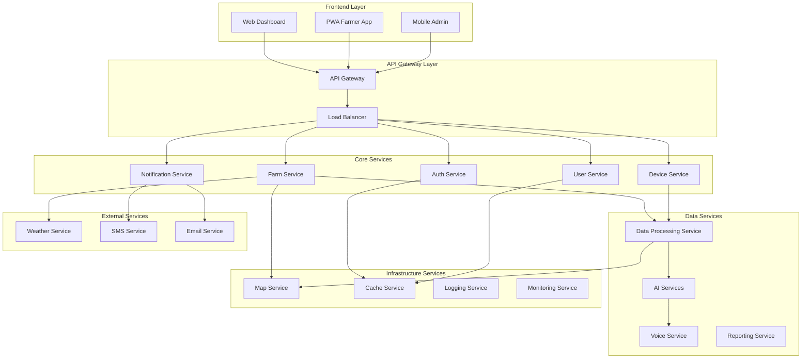
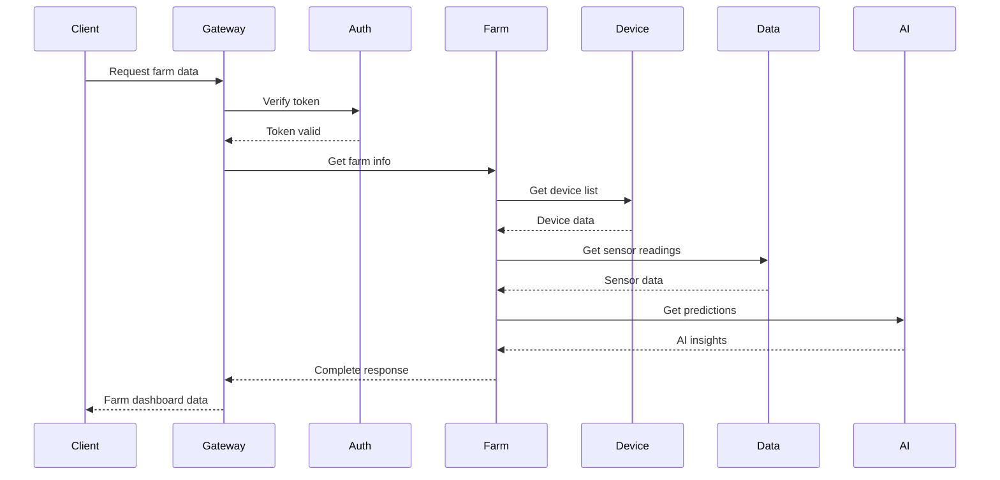

# Service Architecture Documentation - SoilWise Platform

## 🏗️ Service Architecture Overview

The SoilWise platform follows a microservices architecture designed for scalability, maintainability, and resilience in agricultural IoT environments.

## 📊 Service Landscape

### Core Services Architecture


## 🔧 Service Specifications

### 1. Authentication Service
**Purpose**: Centralized authentication and authorization
**Technology**: Node.js + Express + JWT
**Database**: PostgreSQL + Redis

#### Key Features
- JWT token management
- Role-based access control (RBAC)
- Multi-factor authentication
- Session management
- OAuth integration

#### API Endpoints
```typescript
// Authentication endpoints
POST /auth/login
POST /auth/register
POST /auth/refresh
POST /auth/logout
GET  /auth/profile
PUT  /auth/profile
POST /auth/change-password
POST /auth/forgot-password
POST /auth/reset-password

// Authorization endpoints
GET  /auth/permissions
POST /auth/verify-token
GET  /auth/roles
```

#### Configuration
```yaml
auth_service:
  port: 3001
  jwt_secret: ${JWT_SECRET}
  jwt_expiry: 24h
  refresh_expiry: 7d
  bcrypt_rounds: 12
  rate_limit: 100/hour
```

### 2. User Management Service
**Purpose**: User profile and preference management
**Technology**: Node.js + Express + TypeScript
**Database**: PostgreSQL

#### Key Features
- User profile management
- Preference settings
- Team management
- Multi-tenant support
- User activity tracking

#### API Endpoints
```typescript
// User management
GET    /users
POST   /users
GET    /users/:id
PUT    /users/:id
DELETE /users/:id
GET    /users/:id/farms
GET    /users/:id/devices

// Team management
GET    /users/:id/teams
POST   /users/:id/teams
PUT    /users/:id/teams/:teamId
DELETE /users/:id/teams/:teamId
```

### 3. Farm Management Service
**Purpose**: Farm, field, and crop management
**Technology**: Node.js + Express + PostGIS
**Database**: PostgreSQL with PostGIS

#### Key Features
- Farm registration and management
- Field boundary mapping
- Crop planning and tracking
- Harvest management
- Geospatial queries

#### API Endpoints
```typescript
// Farm management
GET    /farms
POST   /farms
GET    /farms/:id
PUT    /farms/:id
DELETE /farms/:id

// Field management
GET    /farms/:id/fields
POST   /farms/:id/fields
GET    /farms/:id/fields/:fieldId
PUT    /farms/:id/fields/:fieldId
DELETE /farms/:id/fields/:fieldId

// Crop management
GET    /farms/:id/crops
POST   /farms/:id/crops
GET    /farms/:id/crops/:cropId
PUT    /farms/:id/crops/:cropId
```

### 4. Device Management Service
**Purpose**: IoT device lifecycle management
**Technology**: Node.js + Express + MQTT
**Database**: PostgreSQL + InfluxDB

#### Key Features
- Device registration and provisioning
- Device health monitoring
- Firmware update management
- Sensor calibration
- Alert management

#### API Endpoints
```typescript
// Device management
GET    /devices
POST   /devices
GET    /devices/:id
PUT    /devices/:id
DELETE /devices/:id
POST   /devices/:id/calibrate
POST   /devices/:id/firmware-update

// Sensor management
GET    /devices/:id/sensors
POST   /devices/:id/sensors
GET    /devices/:id/sensors/:sensorId
PUT    /devices/:id/sensors/:sensorId
GET    /devices/:id/sensors/:sensorId/data
```

### 5. Data Processing Service
**Purpose**: Real-time data processing and analytics
**Technology**: Node.js + Apache Kafka + InfluxDB
**Database**: InfluxDB + MongoDB

#### Key Features
- Real-time data ingestion
- Data validation and cleaning
- Aggregation and analytics
- Threshold monitoring
- Data archiving

#### Processing Pipeline
```javascript
// Data processing pipeline
const pipeline = [
  'data-ingestion',      // MQTT → Raw data queue
  'data-validation',     // Validate sensor readings
  'data-cleaning',       // Remove outliers, interpolate
  'data-enrichment',     // Add weather, location data
  'data-aggregation',    // Calculate hourly/daily averages
  'alert-processing',    // Check thresholds
  'data-storage',        // Store in InfluxDB
  'ai-processing'        // Send to AI services
];
```

### 6. AI Services
**Purpose**: Machine learning and AI-powered insights
**Technology**: Python + FastAPI + PyTorch + LangChain
**Database**: MongoDB + Vector Database

#### Key Features
- Crop disease detection
- Yield prediction
- Weather analysis
- Irrigation optimization
- Voice assistant integration

#### AI Models
```python
# Model registry
models = {
    'crop_disease_detector': {
        'type': 'classification',
        'framework': 'pytorch',
        'accuracy': 0.94,
        'crops': ['tomato', 'potato', 'corn']
    },
    'yield_predictor': {
        'type': 'regression',
        'framework': 'sklearn',
        'r2_score': 0.87,
        'features': ['weather', 'soil', 'irrigation']
    },
    'irrigation_optimizer': {
        'type': 'reinforcement_learning',
        'framework': 'stable_baselines3',
        'reward_function': 'water_efficiency'
    }
}
```

### 7. Voice Assistant Service
**Purpose**: Voice interaction and command processing
**Technology**: Node.js + Python + Whisper + TTS
**Database**: MongoDB

#### Key Features
- Speech-to-text conversion
- Natural language processing
- Command interpretation
- Text-to-speech synthesis
- Multi-language support

#### Voice Commands
```javascript
// Supported voice commands
const commands = {
  'weather': 'Get weather forecast',
  'soil_moisture': 'Check soil moisture levels',
  'irrigation': 'Start/stop irrigation',
  'alerts': 'Get active alerts',
  'crop_status': 'Check crop health',
  'harvest': 'Schedule harvest reminder'
};
```

### 8. Notification Service
**Purpose**: Multi-channel notification delivery
**Technology**: Node.js + Redis + Bull Queue
**Database**: PostgreSQL + Redis

#### Key Features
- Email notifications
- SMS alerts
- Push notifications
- In-app notifications
- Webhook delivery

#### Notification Types
```typescript
enum NotificationType {
  ALERT = 'alert',
  WARNING = 'warning',
  INFO = 'info',
  REMINDER = 'reminder',
  REPORT = 'report'
}

enum NotificationChannel {
  EMAIL = 'email',
  SMS = 'sms',
  PUSH = 'push',
  IN_APP = 'in_app',
  WEBHOOK = 'webhook'
}
```

## 🔄 Inter-Service Communication

### Synchronous Communication
- **HTTP/REST**: For real-time operations
- **gRPC**: For high-performance service-to-service calls
- **GraphQL**: For complex data queries

### Asynchronous Communication
- **Message Queues**: Redis/Bull for job processing
- **Event Streaming**: Apache Kafka for real-time events
- **MQTT**: For IoT device communication

### Communication Patterns
```javascript
// Event-driven architecture
const events = {
  'device.connected': ['device-service', 'notification-service'],
  'sensor.reading': ['data-processing-service', 'ai-service'],
  'threshold.exceeded': ['notification-service', 'alert-service'],
  'user.registered': ['user-service', 'email-service'],
  'farm.created': ['farm-service', 'device-service']
};
```

## 🛡️ Security Architecture

### Service Security
```yaml
security:
  authentication:
    type: JWT
    algorithm: RS256
    expiry: 24h
  
  authorization:
    type: RBAC
    roles: [admin, farmer, viewer]
  
  encryption:
    in_transit: TLS 1.3
    at_rest: AES-256
  
  rate_limiting:
    requests_per_minute: 100
    burst_limit: 20
```

### API Security
- **API Gateway**: Centralized security policies
- **Rate Limiting**: Per-service and per-user limits
- **Input Validation**: Schema validation for all inputs
- **Output Sanitization**: Prevent data leakage

## 📊 Service Monitoring

### Health Checks
```javascript
// Health check endpoints
app.get('/health', (req, res) => {
  const health = {
    status: 'healthy',
    timestamp: new Date().toISOString(),
    uptime: process.uptime(),
    memory: process.memoryUsage(),
    database: dbHealth(),
    dependencies: checkDependencies()
  };
  res.json(health);
});
```

### Metrics Collection
```javascript
// Prometheus metrics
const metrics = {
  http_requests_total: new prometheus.Counter({
    name: 'http_requests_total',
    help: 'Total HTTP requests',
    labelNames: ['method', 'status_code', 'endpoint']
  }),
  
  response_time_seconds: new prometheus.Histogram({
    name: 'response_time_seconds',
    help: 'Response time in seconds',
    labelNames: ['endpoint']
  }),
  
  active_connections: new prometheus.Gauge({
    name: 'active_connections',
    help: 'Number of active connections'
  })
};
```

## 🚀 Deployment Architecture

### Container Configuration
```dockerfile
# Service container template
FROM node:18-alpine

WORKDIR /app

COPY package*.json ./
RUN npm ci --only=production

COPY . .

EXPOSE 3000

HEALTHCHECK --interval=30s --timeout=3s --start-period=5s --retries=3 \
  CMD curl -f http://localhost:3000/health || exit 1

CMD ["npm", "start"]
```

### Kubernetes Deployment
```yaml
# Service deployment template
apiVersion: apps/v1
kind: Deployment
metadata:
  name: farm-service
spec:
  replicas: 3
  selector:
    matchLabels:
      app: farm-service
  template:
    metadata:
      labels:
        app: farm-service
    spec:
      containers:
      - name: farm-service
        image: soilwise/farm-service:latest
        ports:
        - containerPort: 3000
        env:
        - name: DB_HOST
          valueFrom:
            secretKeyRef:
              name: db-secret
              key: host
        resources:
          requests:
            memory: "128Mi"
            cpu: "100m"
          limits:
            memory: "256Mi"
            cpu: "200m"
        livenessProbe:
          httpGet:
            path: /health
            port: 3000
          initialDelaySeconds: 30
          periodSeconds: 10
```

## 🔧 Service Configuration

### Environment Configuration
```yaml
# Service configuration template
service:
  name: farm-service
  port: 3000
  environment: production
  
database:
  host: ${DB_HOST}
  port: ${DB_PORT}
  name: ${DB_NAME}
  user: ${DB_USER}
  password: ${DB_PASSWORD}
  
redis:
  host: ${REDIS_HOST}
  port: ${REDIS_PORT}
  password: ${REDIS_PASSWORD}
  
logging:
  level: info
  format: json
  
monitoring:
  enabled: true
  metrics_port: 9090
  
security:
  jwt_secret: ${JWT_SECRET}
  encryption_key: ${ENCRYPTION_KEY}
```

### Service Discovery
```javascript
// Service registry
const services = {
  'auth-service': {
    host: 'auth-service.soilwise.svc.cluster.local',
    port: 3001,
    health_check: '/health'
  },
  'user-service': {
    host: 'user-service.soilwise.svc.cluster.local',
    port: 3002,
    health_check: '/health'
  },
  'farm-service': {
    host: 'farm-service.soilwise.svc.cluster.local',
    port: 3003,
    health_check: '/health'
  }
};
```

## 🔄 Data Flow Between Services

### Service Communication Flow


## 🛠️ Development Guidelines

### Service Development Standards
1. **API Design**: Follow RESTful principles
2. **Error Handling**: Consistent error responses
3. **Logging**: Structured logging with correlation IDs
4. **Testing**: Unit, integration, and contract tests
5. **Documentation**: OpenAPI/Swagger specifications

### Code Structure
```
service-name/
├── src/
│   ├── controllers/
│   ├── services/
│   ├── models/
│   ├── middleware/
│   ├── utils/
│   └── routes/
├── tests/
├── docs/
├── docker/
├── k8s/
└── package.json
```

## 📈 Performance Optimization

### Service Optimization
- **Connection Pooling**: Database connection management
- **Caching**: Redis for frequently accessed data
- **Compression**: Gzip for HTTP responses
- **Lazy Loading**: Load data on demand

### Scaling Strategies
- **Horizontal Scaling**: Multiple service instances
- **Vertical Scaling**: Increase resource allocation
- **Load Balancing**: Distribute traffic evenly
- **Auto-scaling**: Dynamic resource allocation

## 🔍 Troubleshooting

### Common Issues
1. **Service Discovery**: DNS resolution problems
2. **Database Connections**: Connection pool exhaustion
3. **Memory Leaks**: Monitoring memory usage
4. **Network Timeouts**: Service communication issues

### Debug Commands
```bash
# Check service health
kubectl get pods -l app=farm-service
kubectl describe pod <pod-name>
kubectl logs <pod-name>

# Check service connectivity
kubectl exec -it <pod-name> -- nslookup auth-service
kubectl exec -it <pod-name> -- curl http://auth-service:3001/health
```

## 📚 Additional Resources

### Documentation
- [API Documentation](../api/README.md)
- [Database Schema](../database/README.md)
- [Deployment Guide](../deployment/README.md)

### Tools
- **Service Mesh**: Istio for advanced traffic management
- **Monitoring**: Prometheus + Grafana
- **Logging**: ELK Stack (Elasticsearch, Logstash, Kibana)
- **Tracing**: Jaeger for distributed tracing

---

**🏗️ Service Architecture** - Comprehensive guide to SoilWise microservices

*Last updated: January 2024*
