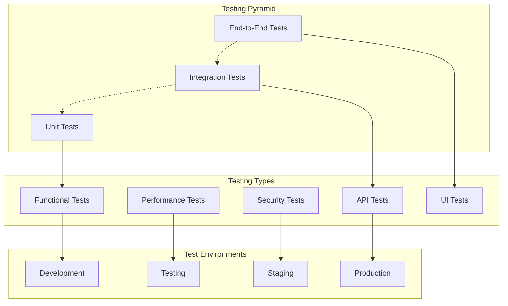

# Testing Documentation - SoilWise Platform

## 🧪 Testing Overview

The SoilWise platform implements comprehensive testing strategies to ensure reliability, performance, and security across all components of the agricultural IoT system.

## 🏗️ Testing Architecture

### Testing Pyramid


## 📋 Testing Strategy

### Test Categories
| Level | Scope | Tools | Coverage |
|-------|-------|-------|----------|
| **Unit** | Individual functions/methods | Jest, Mocha, PyTest | 90%+ |
| **Integration** | Service interactions | Supertest, TestContainers | 80%+ |
| **Contract** | API contracts | Pact, OpenAPI | 100% |
| **End-to-End** | User workflows | Cypress, Playwright | 70%+ |
| **Performance** | Load/stress testing | K6, Artillery | Key flows |
| **Security** | Vulnerability testing | OWASP ZAP, Snyk | Critical paths |

### Testing Standards
```typescript
// Test naming convention
describe('UserService', () => {
  describe('createUser', () => {
    it('should create user with valid data', async () => {
      // Given
      const userData = {
        email: 'test@example.com',
        password: 'SecurePass123',
        role: 'farmer'
      };
      
      // When
      const result = await userService.createUser(userData);
      
      // Then
      expect(result.id).toBeDefined();
      expect(result.email).toBe(userData.email);
      expect(result.password).toBeUndefined(); // Password should not be returned
    });
    
    it('should throw error for invalid email', async () => {
      // Given
      const userData = {
        email: 'invalid-email',
        password: 'SecurePass123'
      };
      
      // When & Then
      await expect(userService.createUser(userData))
        .rejects
        .toThrow('Invalid email format');
    });
  });
});
```

## 🔧 Unit Testing

### Jest Configuration
```javascript
// jest.config.js
module.exports = {
  preset: 'ts-jest',
  testEnvironment: 'node',
  roots: ['<rootDir>/src', '<rootDir>/tests'],
  testMatch: ['**/__tests__/**/*.test.ts', '**/?(*.)+(spec|test).ts'],
  collectCoverageFrom: [
    'src/**/*.ts',
    '!src/**/*.d.ts',
    '!src/index.ts',
    '!src/types/**/*'
  ],
  coverageThreshold: {
    global: {
      branches: 90,
      functions: 90,
      lines: 90,
      statements: 90
    }
  },
  setupFilesAfterEnv: ['<rootDir>/tests/setup.ts'],
  testTimeout: 10000,
  maxWorkers: 4
};
```

### Testing Utilities
```typescript
// tests/utils/test-helpers.ts
export class TestHelpers {
  static createMockUser(overrides?: Partial<User>): User {
    return {
      id: 'test-user-id',
      email: 'test@example.com',
      role: 'farmer',
      created_at: new Date(),
      ...overrides
    };
  }
  
  static createMockFarm(overrides?: Partial<Farm>): Farm {
    return {
      id: 'test-farm-id',
      name: 'Test Farm',
      owner_id: 'test-user-id',
      area_hectares: 10.5,
      location: { lat: 40.7128, lng: -74.0060 },
      ...overrides
    };
  }
  
  static createMockSensorData(overrides?: Partial<SensorReading>): SensorReading {
    return {
      id: 'test-reading-id',
      device_id: 'test-device-id',
      sensor_type: 'soil_moisture',
      value: 45.5,
      timestamp: new Date(),
      ...overrides
    };
  }
}

// Database test helpers
export class DatabaseTestHelpers {
  static async setupTestDatabase(): Promise<void> {
    await db.migrate.latest();
    await db.seed.run();
  }
  
  static async cleanupTestDatabase(): Promise<void> {
    await db.migrate.rollback();
  }
  
  static async truncateAllTables(): Promise<void> {
    const tables = ['users', 'farms', 'devices', 'sensor_readings'];
    for (const table of tables) {
      await db(table).truncate();
    }
  }
}
```

### Service Testing Examples
```typescript
// tests/services/farm.service.test.ts
import { FarmService } from '../../src/services/farm.service';
import { TestHelpers, DatabaseTestHelpers } from '../utils/test-helpers';

describe('FarmService', () => {
  let farmService: FarmService;
  
  beforeAll(async () => {
    await DatabaseTestHelpers.setupTestDatabase();
  });
  
  afterAll(async () => {
    await DatabaseTestHelpers.cleanupTestDatabase();
  });
  
  beforeEach(async () => {
    farmService = new FarmService();
    await DatabaseTestHelpers.truncateAllTables();
  });
  
  describe('createFarm', () => {
    it('should create farm successfully', async () => {
      // Given
      const user = TestHelpers.createMockUser();
      const farmData = {
        name: 'New Farm',
        area_hectares: 25.5,
        location: { lat: 40.7128, lng: -74.0060 }
      };
      
      // When
      const result = await farmService.createFarm(user.id, farmData);
      
      // Then
      expect(result.id).toBeDefined();
      expect(result.name).toBe(farmData.name);
      expect(result.owner_id).toBe(user.id);
      expect(result.area_hectares).toBe(farmData.area_hectares);
    });
    
    it('should validate farm data', async () => {
      // Given
      const user = TestHelpers.createMockUser();
      const invalidFarmData = {
        name: '', // Invalid: empty name
        area_hectares: -5, // Invalid: negative area
        location: { lat: 200, lng: 200 } // Invalid: out of range coordinates
      };
      
      // When & Then
      await expect(farmService.createFarm(user.id, invalidFarmData))
        .rejects
        .toThrow('Invalid farm data');
    });
  });
  
  describe('getFarmsByUser', () => {
    it('should return user farms', async () => {
      // Given
      const user = TestHelpers.createMockUser();
      const farm1 = await farmService.createFarm(user.id, TestHelpers.createMockFarm());
      const farm2 = await farmService.createFarm(user.id, TestHelpers.createMockFarm());
      
      // When
      const results = await farmService.getFarmsByUser(user.id);
      
      // Then
      expect(results).toHaveLength(2);
      expect(results.map(f => f.id)).toContain(farm1.id);
      expect(results.map(f => f.id)).toContain(farm2.id);
    });
    
    it('should return empty array for user with no farms', async () => {
      // Given
      const user = TestHelpers.createMockUser();
      
      // When
      const results = await farmService.getFarmsByUser(user.id);
      
      // Then
      expect(results).toHaveLength(0);
    });
  });
});
```

## 🔗 Integration Testing

### Test Containers Setup
```typescript
// tests/integration/setup.ts
import { GenericContainer, StartedTestContainer } from 'testcontainers';

export class IntegrationTestSetup {
  static async setupTestEnvironment(): Promise<TestEnvironment> {
    // PostgreSQL container
    const postgresContainer = await new GenericContainer('postgres:14')
      .withEnvironment({
        POSTGRES_DB: 'soilwise_test',
        POSTGRES_USER: 'test',
        POSTGRES_PASSWORD: 'test'
      })
      .withExposedPorts(5432)
      .start();
    
    // Redis container
    const redisContainer = await new GenericContainer('redis:7-alpine')
      .withExposedPorts(6379)
      .start();
    
    // InfluxDB container
    const influxContainer = await new GenericContainer('influxdb:2.0')
      .withEnvironment({
        INFLUXDB_DB: 'soilwise_test',
        INFLUXDB_ADMIN_USER: 'admin',
        INFLUXDB_ADMIN_PASSWORD: 'admin'
      })
      .withExposedPorts(8086)
      .start();
    
    // MQTT container
    const mqttContainer = await new GenericContainer('eclipse-mosquitto:2.0')
      .withExposedPorts(1883)
      .start();
    
    return {
      postgres: {
        host: postgresContainer.getHost(),
        port: postgresContainer.getMappedPort(5432),
        database: 'soilwise_test',
        username: 'test',
        password: 'test'
      },
      redis: {
        host: redisContainer.getHost(),
        port: redisContainer.getMappedPort(6379)
      },
      influx: {
        host: influxContainer.getHost(),
        port: influxContainer.getMappedPort(8086)
      },
      mqtt: {
        host: mqttContainer.getHost(),
        port: mqttContainer.getMappedPort(1883)
      },
      containers: [postgresContainer, redisContainer, influxContainer, mqttContainer]
    };
  }
}
```

### API Integration Tests
```typescript
// tests/integration/api.test.ts
import request from 'supertest';
import { app } from '../../src/app';
import { IntegrationTestSetup } from './setup';

describe('API Integration Tests', () => {
  let testEnv: TestEnvironment;
  let authToken: string;
  
  beforeAll(async () => {
    testEnv = await IntegrationTestSetup.setupTestEnvironment();
    // Setup app with test environment
    process.env.DB_HOST = testEnv.postgres.host;
    process.env.DB_PORT = testEnv.postgres.port.toString();
    
    // Get auth token
    const response = await request(app)
      .post('/auth/login')
      .send({
        email: 'test@example.com',
        password: 'testpassword'
      });
    
    authToken = response.body.token;
  });
  
  afterAll(async () => {
    // Cleanup containers
    await Promise.all(testEnv.containers.map(c => c.stop()));
  });
  
  describe('Farm API', () => {
    it('should create and retrieve farm', async () => {
      // Create farm
      const farmData = {
        name: 'Integration Test Farm',
        area_hectares: 15.5,
        location: { lat: 40.7128, lng: -74.0060 }
      };
      
      const createResponse = await request(app)
        .post('/farms')
        .set('Authorization', `Bearer ${authToken}`)
        .send(farmData)
        .expect(201);
      
      const farmId = createResponse.body.id;
      
      // Retrieve farm
      const getResponse = await request(app)
        .get(`/farms/${farmId}`)
        .set('Authorization', `Bearer ${authToken}`)
        .expect(200);
      
      expect(getResponse.body.name).toBe(farmData.name);
      expect(getResponse.body.area_hectares).toBe(farmData.area_hectares);
    });
    
    it('should handle authorization correctly', async () => {
      await request(app)
        .get('/farms')
        .expect(401); // No auth token
      
      await request(app)
        .get('/farms')
        .set('Authorization', 'Bearer invalid-token')
        .expect(401); // Invalid token
    });
  });
  
  describe('Device API', () => {
    it('should register and manage devices', async () => {
      // Create farm first
      const farmResponse = await request(app)
        .post('/farms')
        .set('Authorization', `Bearer ${authToken}`)
        .send({
          name: 'Test Farm',
          area_hectares: 10,
          location: { lat: 40.7128, lng: -74.0060 }
        });
      
      const farmId = farmResponse.body.id;
      
      // Register device
      const deviceData = {
        device_id: 'test-device-001',
        device_type: 'soil_sensor',
        name: 'Test Soil Sensor',
        location: { lat: 40.7128, lng: -74.0060 }
      };
      
      const deviceResponse = await request(app)
        .post(`/farms/${farmId}/devices`)
        .set('Authorization', `Bearer ${authToken}`)
        .send(deviceData)
        .expect(201);
      
      expect(deviceResponse.body.device_id).toBe(deviceData.device_id);
      expect(deviceResponse.body.farm_id).toBe(farmId);
    });
  });
});
```

## 🎭 End-to-End Testing

### Cypress Configuration
```typescript
// cypress.config.ts
import { defineConfig } from 'cypress';

export default defineConfig({
  e2e: {
    baseUrl: 'http://localhost:3000',
    supportFile: 'cypress/support/e2e.ts',
    specPattern: 'cypress/e2e/**/*.cy.ts',
    video: true,
    screenshot: true,
    defaultCommandTimeout: 10000,
    viewportWidth: 1280,
    viewportHeight: 720,
    
    setupNodeEvents(on, config) {
      // Custom tasks
      on('task', {
        seedDatabase() {
          // Seed test data
          return null;
        },
        
        cleanDatabase() {
          // Clean test data
          return null;
        }
      });
      
      // Code coverage
      require('@cypress/code-coverage/task')(on, config);
      
      return config;
    }
  }
});
```

### E2E Test Examples
```typescript
// cypress/e2e/dashboard.cy.ts
describe('Dashboard', () => {
  beforeEach(() => {
    cy.task('seedDatabase');
    cy.login('farmer@example.com', 'password123');
  });
  
  afterEach(() => {
    cy.task('cleanDatabase');
  });
  
  it('should display farm overview', () => {
    cy.visit('/dashboard');
    
    // Check page elements
    cy.get('[data-testid="farm-overview"]').should('be.visible');
    cy.get('[data-testid="sensor-status"]').should('be.visible');
    cy.get('[data-testid="weather-widget"]').should('be.visible');
    
    // Check data loading
    cy.get('[data-testid="loading-spinner"]').should('not.exist');
    cy.get('[data-testid="farm-name"]').should('contain.text', 'Test Farm');
  });
  
  it('should navigate to farm details', () => {
    cy.visit('/dashboard');
    
    cy.get('[data-testid="farm-card"]').first().click();
    cy.url().should('include', '/farms/');
    
    // Check farm details page
    cy.get('[data-testid="farm-details"]').should('be.visible');
    cy.get('[data-testid="device-list"]').should('be.visible');
    cy.get('[data-testid="sensor-charts"]').should('be.visible');
  });
  
  it('should handle real-time updates', () => {
    cy.visit('/dashboard');
    
    // Mock WebSocket message
    cy.window().then((win) => {
      const mockData = {
        type: 'sensor_reading',
        device_id: 'test-device-001',
        value: 55.5,
        timestamp: new Date().toISOString()
      };
      
      win.dispatchEvent(new CustomEvent('websocket-message', { detail: mockData }));
    });
    
    // Check UI updates
    cy.get('[data-testid="sensor-value"]').should('contain.text', '55.5');
    cy.get('[data-testid="last-updated"]').should('contain.text', 'Just now');
  });
});

// cypress/e2e/device-management.cy.ts
describe('Device Management', () => {
  beforeEach(() => {
    cy.task('seedDatabase');
    cy.login('farmer@example.com', 'password123');
  });
  
  it('should add new device', () => {
    cy.visit('/devices');
    
    cy.get('[data-testid="add-device-btn"]').click();
    
    // Fill device form
    cy.get('[data-testid="device-id-input"]').type('new-device-001');
    cy.get('[data-testid="device-type-select"]').select('soil_sensor');
    cy.get('[data-testid="device-name-input"]').type('New Soil Sensor');
    
    // Set location
    cy.get('[data-testid="location-picker"]').click();
    cy.get('[data-testid="map-marker"]').click();
    
    // Submit form
    cy.get('[data-testid="save-device-btn"]').click();
    
    // Check success
    cy.get('[data-testid="success-message"]').should('be.visible');
    cy.get('[data-testid="device-list"]').should('contain.text', 'New Soil Sensor');
  });
  
  it('should validate device form', () => {
    cy.visit('/devices');
    
    cy.get('[data-testid="add-device-btn"]').click();
    
    // Try to submit empty form
    cy.get('[data-testid="save-device-btn"]').click();
    
    // Check validation errors
    cy.get('[data-testid="device-id-error"]').should('contain.text', 'Device ID is required');
    cy.get('[data-testid="device-name-error"]').should('contain.text', 'Device name is required');
  });
});
```

### Custom Cypress Commands
```typescript
// cypress/support/commands.ts
declare global {
  namespace Cypress {
    interface Chainable {
      login(email: string, password: string): Chainable<void>;
      seedFarmData(): Chainable<void>;
      mockWebSocket(): Chainable<void>;
    }
  }
}

Cypress.Commands.add('login', (email: string, password: string) => {
  cy.request({
    method: 'POST',
    url: '/auth/login',
    body: {
      email,
      password
    }
  }).then((response) => {
    const token = response.body.token;
    cy.window().then((win) => {
      win.localStorage.setItem('auth_token', token);
    });
  });
});

Cypress.Commands.add('seedFarmData', () => {
  cy.request({
    method: 'POST',
    url: '/test/seed',
    body: {
      farms: 1,
      devices: 3,
      sensorReadings: 100
    }
  });
});

Cypress.Commands.add('mockWebSocket', () => {
  cy.window().then((win) => {
    const mockWebSocket = {
      send: cy.stub(),
      close: cy.stub(),
      addEventListener: cy.stub(),
      removeEventListener: cy.stub(),
      readyState: 1 // OPEN
    };
    
    win.WebSocket = cy.stub().returns(mockWebSocket);
  });
});
```

## ⚡ Performance Testing

### K6 Load Testing
```javascript
// tests/performance/load-test.js
import http from 'k6/http';
import { check, sleep } from 'k6';
import { Rate } from 'k6/metrics';

export let errorRate = new Rate('errors');

export let options = {
  stages: [
    { duration: '2m', target: 100 }, // Ramp up
    { duration: '5m', target: 100 }, // Stay at 100 users
    { duration: '2m', target: 200 }, // Ramp up to 200 users
    { duration: '5m', target: 200 }, // Stay at 200 users
    { duration: '2m', target: 0 },   // Ramp down
  ],
  thresholds: {
    http_req_duration: ['p(95)<500'], // 95% of requests under 500ms
    http_req_failed: ['rate<0.1'],    // Error rate under 10%
    errors: ['rate<0.1'],             // Custom error rate under 10%
  },
};

const BASE_URL = 'https://api.soilwise.com';

export function setup() {
  // Login and get token
  const response = http.post(`${BASE_URL}/auth/login`, {
    email: 'test@example.com',
    password: 'testpassword'
  });
  
  return {
    token: response.json('token')
  };
}

export default function (data) {
  const headers = {
    'Authorization': `Bearer ${data.token}`,
    'Content-Type': 'application/json'
  };
  
  // Test dashboard endpoint
  let response = http.get(`${BASE_URL}/dashboard`, { headers });
  check(response, {
    'dashboard status is 200': (r) => r.status === 200,
    'dashboard response time < 500ms': (r) => r.timings.duration < 500,
  }) || errorRate.add(1);
  
  sleep(1);
  
  // Test farms endpoint
  response = http.get(`${BASE_URL}/farms`, { headers });
  check(response, {
    'farms status is 200': (r) => r.status === 200,
    'farms response time < 300ms': (r) => r.timings.duration < 300,
  }) || errorRate.add(1);
  
  sleep(1);
  
  // Test sensor data endpoint
  response = http.get(`${BASE_URL}/sensors/data?hours=24`, { headers });
  check(response, {
    'sensor data status is 200': (r) => r.status === 200,
    'sensor data response time < 1000ms': (r) => r.timings.duration < 1000,
  }) || errorRate.add(1);
  
  sleep(2);
}

export function teardown(data) {
  // Cleanup if needed
}
```

### Stress Testing
```javascript
// tests/performance/stress-test.js
import http from 'k6/http';
import { check } from 'k6';

export let options = {
  stages: [
    { duration: '10m', target: 1000 }, // Simulate realistic load
    { duration: '30m', target: 1000 }, // Stay at realistic load
    { duration: '10m', target: 2000 }, // Spike to double capacity
    { duration: '5m', target: 2000 },  // Stay at double capacity
    { duration: '10m', target: 0 },    // Scale down
  ],
  thresholds: {
    http_req_duration: ['p(99)<2000'], // 99% under 2s
    http_req_failed: ['rate<0.05'],    // Less than 5% errors
  },
};

export default function () {
  // High-load scenario
  const responses = http.batch([
    ['GET', 'https://api.soilwise.com/dashboard'],
    ['GET', 'https://api.soilwise.com/farms'],
    ['GET', 'https://api.soilwise.com/devices'],
    ['GET', 'https://api.soilwise.com/sensors/data']
  ]);
  
  responses.forEach((response) => {
    check(response, {
      'status is 200': (r) => r.status === 200,
      'response time acceptable': (r) => r.timings.duration < 2000,
    });
  });
}
```

## 🔒 Security Testing

### OWASP ZAP Integration
```python
# tests/security/zap-scan.py
import time
from zapv2 import ZAPv2

def run_security_scan():
    # Configure ZAP
    zap = ZAPv2(proxies={'http': 'http://127.0.0.1:8080', 'https': 'http://127.0.0.1:8080'})
    
    target_url = 'https://app.soilwise.com'
    
    # Spider the application
    print('Starting spider...')
    spider_id = zap.spider.scan(target_url)
    
    while int(zap.spider.status(spider_id)) < 100:
        print(f'Spider progress: {zap.spider.status(spider_id)}%')
        time.sleep(10)
    
    print('Spider completed')
    
    # Active scan
    print('Starting active scan...')
    scan_id = zap.ascan.scan(target_url)
    
    while int(zap.ascan.status(scan_id)) < 100:
        print(f'Active scan progress: {zap.ascan.status(scan_id)}%')
        time.sleep(10)
    
    print('Active scan completed')
    
    # Generate report
    html_report = zap.core.htmlreport()
    with open('security-report.html', 'w') as f:
        f.write(html_report)
    
    # Check for high-risk issues
    alerts = zap.core.alerts(baseurl=target_url)
    high_risk_alerts = [alert for alert in alerts if alert['risk'] == 'High']
    
    if high_risk_alerts:
        print(f'Found {len(high_risk_alerts)} high-risk security issues!')
        for alert in high_risk_alerts:
            print(f'- {alert["alert"]}: {alert["desc"]}')
        return False
    
    print('No high-risk security issues found')
    return True

if __name__ == '__main__':
    success = run_security_scan()
    exit(0 if success else 1)
```

### Security Test Automation
```yaml
# .github/workflows/security-tests.yml
name: Security Tests

on:
  push:
    branches: [main]
  schedule:
    - cron: '0 2 * * 1'  # Weekly security scan

jobs:
  security-scan:
    runs-on: ubuntu-latest
    steps:
    - uses: actions/checkout@v2
    
    - name: Start ZAP
      run: |
        docker run -d -p 8080:8080 owasp/zap2docker-stable zap.sh -daemon -host 0.0.0.0 -port 8080
        sleep 30
    
    - name: Run security scan
      run: |
        python tests/security/zap-scan.py
    
    - name: Upload security report
      uses: actions/upload-artifact@v2
      with:
        name: security-report
        path: security-report.html
    
    - name: Dependency scan
      run: |
        npm audit --audit-level=moderate
        
    - name: Container scan
      run: |
        docker run --rm -v $(pwd):/app clair-scanner:latest --ip localhost /app
```

## 📊 Test Reporting and Metrics

### Test Coverage Configuration
```javascript
// jest.config.js - Coverage settings
module.exports = {
  collectCoverageFrom: [
    'src/**/*.{js,ts}',
    '!src/**/*.d.ts',
    '!src/types/**/*',
    '!src/migrations/**/*'
  ],
  coverageReporters: ['text', 'lcov', 'html', 'cobertura'],
  coverageThreshold: {
    global: {
      branches: 85,
      functions: 85,
      lines: 85,
      statements: 85
    },
    './src/services/': {
      branches: 90,
      functions: 90,
      lines: 90,
      statements: 90
    }
  }
};
```

### Test Metrics Dashboard
```typescript
// tests/utils/metrics-collector.ts
export class TestMetricsCollector {
  static async collectMetrics(): Promise<TestMetrics> {
    const unitTestResults = await this.getUnitTestResults();
    const integrationTestResults = await this.getIntegrationTestResults();
    const e2eTestResults = await this.getE2ETestResults();
    const performanceTestResults = await this.getPerformanceTestResults();
    
    return {
      unit_tests: {
        total: unitTestResults.total,
        passed: unitTestResults.passed,
        failed: unitTestResults.failed,
        coverage: unitTestResults.coverage,
        duration: unitTestResults.duration
      },
      integration_tests: {
        total: integrationTestResults.total,
        passed: integrationTestResults.passed,
        failed: integrationTestResults.failed,
        duration: integrationTestResults.duration
      },
      e2e_tests: {
        total: e2eTestResults.total,
        passed: e2eTestResults.passed,
        failed: e2eTestResults.failed,
        duration: e2eTestResults.duration
      },
      performance_tests: {
        response_time_p95: performanceTestResults.p95,
        response_time_p99: performanceTestResults.p99,
        error_rate: performanceTestResults.errorRate,
        throughput: performanceTestResults.throughput
      },
      quality_gates: {
        coverage_threshold: 85,
        performance_threshold: 500, // ms
        error_rate_threshold: 0.01  // 1%
      }
    };
  }
}
```

## 🚀 Test Automation Pipeline

### CI/CD Testing Pipeline
```yaml
# .github/workflows/test-pipeline.yml
name: Test Pipeline

on:
  push:
    branches: [main, develop]
  pull_request:
    branches: [main]

jobs:
  lint:
    runs-on: ubuntu-latest
    steps:
    - uses: actions/checkout@v2
    - uses: actions/setup-node@v2
      with:
        node-version: '18'
    
    - name: Install dependencies
      run: npm ci
    
    - name: Run linter
      run: npm run lint
    
    - name: Run type check
      run: npm run type-check

  unit-tests:
    runs-on: ubuntu-latest
    steps:
    - uses: actions/checkout@v2
    - uses: actions/setup-node@v2
      with:
        node-version: '18'
    
    - name: Install dependencies
      run: npm ci
    
    - name: Run unit tests
      run: npm run test:unit
    
    - name: Upload coverage
      uses: codecov/codecov-action@v2
      with:
        files: ./coverage/lcov.info

  integration-tests:
    runs-on: ubuntu-latest
    services:
      postgres:
        image: postgres:14
        env:
          POSTGRES_PASSWORD: postgres
          POSTGRES_DB: test_db
        options: >-
          --health-cmd pg_isready
          --health-interval 10s
          --health-timeout 5s
          --health-retries 5
        ports:
          - 5432:5432
      
      redis:
        image: redis:7-alpine
        options: >-
          --health-cmd "redis-cli ping"
          --health-interval 10s
          --health-timeout 5s
          --health-retries 5
        ports:
          - 6379:6379
    
    steps:
    - uses: actions/checkout@v2
    - uses: actions/setup-node@v2
      with:
        node-version: '18'
    
    - name: Install dependencies
      run: npm ci
    
    - name: Run integration tests
      run: npm run test:integration
      env:
        DB_HOST: localhost
        DB_PORT: 5432
        REDIS_HOST: localhost
        REDIS_PORT: 6379

  e2e-tests:
    runs-on: ubuntu-latest
    steps:
    - uses: actions/checkout@v2
    - uses: actions/setup-node@v2
      with:
        node-version: '18'
    
    - name: Install dependencies
      run: npm ci
    
    - name: Build application
      run: npm run build
    
    - name: Start application
      run: npm start &
    
    - name: Wait for application
      run: npx wait-on http://localhost:3000
    
    - name: Run E2E tests
      run: npm run test:e2e
    
    - name: Upload E2E artifacts
      uses: actions/upload-artifact@v2
      if: failure()
      with:
        name: e2e-artifacts
        path: |
          cypress/videos
          cypress/screenshots

  performance-tests:
    runs-on: ubuntu-latest
    if: github.ref == 'refs/heads/main'
    steps:
    - uses: actions/checkout@v2
    
    - name: Install k6
      run: |
        sudo apt-key adv --keyserver hkp://keyserver.ubuntu.com:80 --recv-keys C5AD17C747E3415A3642D57D77C6C491D6AC1D69
        echo "deb https://dl.k6.io/deb stable main" | sudo tee /etc/apt/sources.list.d/k6.list
        sudo apt-get update
        sudo apt-get install k6
    
    - name: Run performance tests
      run: k6 run tests/performance/load-test.js
    
    - name: Upload performance report
      uses: actions/upload-artifact@v2
      with:
        name: performance-report
        path: performance-report.html
```

## 📚 Testing Best Practices

### Test Organization
```
tests/
├── unit/
│   ├── services/
│   ├── controllers/
│   ├── utils/
│   └── models/
├── integration/
│   ├── api/
│   ├── database/
│   └── services/
├── e2e/
│   ├── dashboard/
│   ├── farms/
│   └── devices/
├── performance/
│   ├── load-tests/
│   └── stress-tests/
├── security/
│   ├── vulnerability-scans/
│   └── penetration-tests/
└── utils/
    ├── test-helpers.ts
    ├── mock-data.ts
    └── test-setup.ts
```

### Test Quality Guidelines
1. **Write Clear Test Names**: Describe what is being tested and expected outcome
2. **Follow AAA Pattern**: Arrange, Act, Assert
3. **Use Test Data Builders**: Create reusable test data factories
4. **Mock External Dependencies**: Isolate units under test
5. **Test Edge Cases**: Include boundary conditions and error scenarios
6. **Maintain Test Independence**: Each test should be able to run in isolation
7. **Keep Tests Fast**: Unit tests should complete in milliseconds
8. **Use Descriptive Assertions**: Make test failures easy to understand

### Test Maintenance
```typescript
// Test maintenance utilities
export class TestMaintenance {
  static async detectFlakiness(testResults: TestResult[]): Promise<FlakyTest[]> {
    const flakyTests = testResults.filter(test => 
      test.runs.some(run => run.status === 'passed') &&
      test.runs.some(run => run.status === 'failed')
    );
    
    return flakyTests.map(test => ({
      name: test.name,
      flakinessScore: this.calculateFlakinessScore(test.runs),
      recommendation: this.getRecommendation(test)
    }));
  }
  
  static async identifySlowTests(testResults: TestResult[]): Promise<SlowTest[]> {
    const slowTests = testResults.filter(test => 
      test.averageDuration > 5000 // 5 seconds
    );
    
    return slowTests.map(test => ({
      name: test.name,
      averageDuration: test.averageDuration,
      recommendation: 'Consider optimizing or moving to integration tests'
    }));
  }
}
```

---

**🧪 Testing Documentation** - Comprehensive guide to SoilWise platform testing

*Last updated: January 2024*
